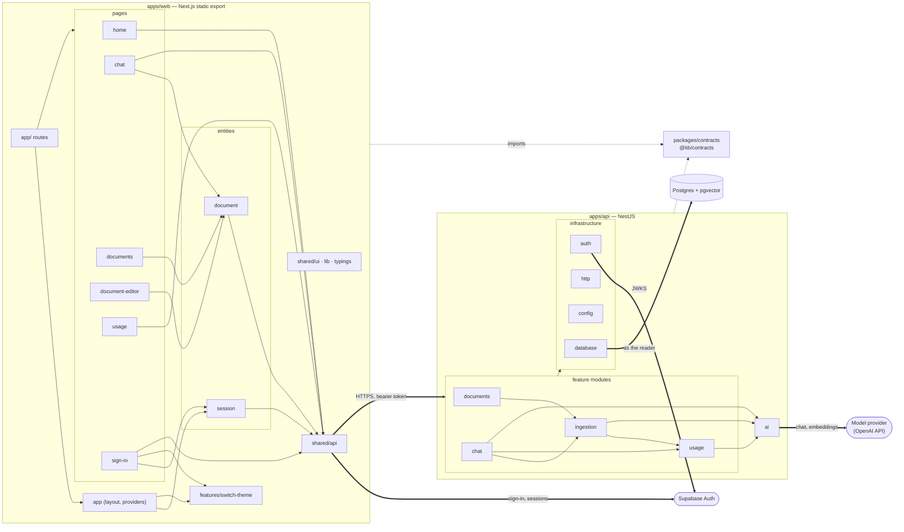

# Design notes: how the knowledge base works, and why

This document explains the choices behind the knowledge base and the parts of it that are not obvious from reading the code. It is written for an engineer who has cloned the repository and wants to know why it is shaped the way it is, what the alternatives were, and what it would take to grow it into a production system.

[`README.md`](../README.md) comes first: it says how to run the app and states the main architecture decisions in a paragraph each. Where an entry here covers a decision the README already states, it links to that paragraph and adds only what the README leaves out — the alternatives, the mechanism, the path to something else. Code is cited as `path:line` links, so the document reads best with the repository open beside it.

The sections go from the outside in. §1 is the map, and the sections after it name modules from it. §2 and §3 are the choices and the mechanisms. §4 is the house style the code is written in and what the agent-driven process behind it produced. §5 is what this proof of concept leaves out on purpose, and what a real app would do instead.

## Contents

- [1. Bird's-eye view](#1-birds-eye-view)
- [2. Choices and their alternatives](#2-choices-and-their-alternatives)
  - [A NestJS API beside the web app, in a monorepo](#a-nestjs-api-beside-the-web-app-in-a-monorepo)
  - [One contracts package, not a shared src/](#one-contracts-package-not-a-shared-src)
  - [Node's test runner, not Vitest](#nodes-test-runner-not-vitest)
  - [A static export for the web app](#a-static-export-for-the-web-app)
  - [A hand-drawn chart, and when makeshift code is right](#a-hand-drawn-chart-and-when-makeshift-code-is-right)
  - [The session in useSyncExternalStore, not Zustand](#the-session-in-usesyncexternalstore-not-zustand)
  - [TanStack Query for everything the server owns](#tanstack-query-for-everything-the-server-owns)
- [3. How it works](#3-how-it-works)
  - [Providers: one client, and a preset per provider](#providers-one-client-and-a-preset-per-provider)
  - [How the API knows a request is a ReaderRequest](#how-the-api-knows-a-request-is-a-readerrequest)
  - [Condensing a follow-up before retrieval](#condensing-a-follow-up-before-retrieval)
  - [When a model call's usage is null](#when-a-model-calls-usage-is-null)
  - [Asking in one conversation, switching to another, and coming back](#asking-in-one-conversation-switching-to-another-and-coming-back)
  - [Supabase, served locally](#supabase-served-locally)
  - [How row-level security is enforced](#how-row-level-security-is-enforced)
  - [The database functions](#the-database-functions)
  - [Changing the schema: migrations](#changing-the-schema-migrations)
  - [The generated database.types.ts](#the-generated-databasetypests)
  - [@kb/contracts: one set of schemas on both sides of the wire](#kbcontracts-one-set-of-schemas-on-both-sides-of-the-wire)
  - [Turborepo: the task graph over the workspaces](#turborepo-the-task-graph-over-the-workspaces)
  - [The ESLint boundaries setup, and why a workspace package is an element type](#the-eslint-boundaries-setup-and-why-a-workspace-package-is-an-element-type)
  - [apps/api/.swcrc and apps/api/register.js: compiling the API with decorator metadata](#appsapiswcrc-and-appsapiregisterjs-compiling-the-api-with-decorator-metadata)
  - [Tests beside the code, tests under apps/api/test/, and the pgTAP suites](#tests-beside-the-code-tests-under-appsapitest-and-the-pgtap-suites)
  - [The usage chart's SVG, from data to path commands](#the-usage-charts-svg-from-data-to-path-commands)
- [4. House style and what the process produced](#4-house-style-and-what-the-process-produced)
  - [{...{ asking }} and the vova/* lint rules](#-asking--and-the-vova-lint-rules)
  - [What the /polish passes produced](#what-the-polish-passes-produced)
  - [The confirmation copy](#the-confirmation-copy)
  - [Small component modules](#small-component-modules)
  - [Sass tokens generated from TypeScript](#sass-tokens-generated-from-typescript)
  - [The type-overlap check](#the-type-overlap-check)
- [5. Tradeoffs](#5-tradeoffs)
  - [Routes are strings, matched by prefix](#routes-are-strings-matched-by-prefix)
  - [The API client takes any path](#the-api-client-takes-any-path)
  - [What the contract does not cover](#what-the-contract-does-not-cover)
  - [Duplication left in place](#duplication-left-in-place)
  - [Query code without a helper layer](#query-code-without-a-helper-layer)
  - [Files that outgrow a single read](#files-that-outgrow-a-single-read)
  - [Hardcoded copy, and an answer screen readers do not hear](#hardcoded-copy-and-an-answer-screen-readers-do-not-hear)
  - [No tests drive the UI](#no-tests-drive-the-ui)
  - [Chunking by structure, and what comes after it](#chunking-by-structure-and-what-comes-after-it)
  - [The answer prompt, and where the sources sit](#the-answer-prompt-and-where-the-sources-sit)
  - [The prompt has no token budget](#the-prompt-has-no-token-budget)
  - [No prompt caching](#no-prompt-caching)
  - [Bulk calls to a provider, and ingestion that dies half-way](#bulk-calls-to-a-provider-and-ingestion-that-dies-half-way)
  - [Lists stop at 1,000 rows without saying so](#lists-stop-at-1000-rows-without-saying-so)
  - [Two tabs overwrite each other](#two-tabs-overwrite-each-other)
  - [The answer stream has no heartbeat, backpressure or resume](#the-answer-stream-has-no-heartbeat-backpressure-or-resume)
  - [Logging covers a few failures, and nothing else is observed](#logging-covers-a-few-failures-and-nothing-else-is-observed)
  - [Server-owned fields can be written straight to the database](#server-owned-fields-can-be-written-straight-to-the-database)
  - [Password sign-in on the local defaults](#password-sign-in-on-the-local-defaults)
  - [Security review, and why agents make it harder](#security-review-and-why-agents-make-it-harder)

## 1. Bird's-eye view

One diagram holds the whole system: two apps, the package of shapes they share, and the three services outside the code that they call.



Solid arrows are imports, dotted ones imports of the shared package, and thick ones calls over the network. Two sets of edges are left out because they would connect nearly everything: every web slice uses `shared/ui`, `shared/lib` and `shared/typings`, and every API feature module uses the infrastructure modules, drawn as one arrow. `apps/web/app/` is Next's router and only routes; the modules it routes to live in `apps/web/src/`, in Feature-Sliced Design's layers ([`.claude/rules/fsd.md`](../.claude/rules/fsd.md)). What sits where is also in [README § "Layout"](../README.md#layout).

**One question, followed through.** A reader types a question in the chat.

1. The chat page posts it to `/conversations/:id/messages` through `shared/api`, which attaches the reader's Supabase access token ([`apps/web/src/shared/api/api.ts:9`](../apps/web/src/shared/api/api.ts#L9)). The browser never talks to Postgres for data; it talks to Supabase only to sign in.
2. The API's global guard verifies the token against Supabase Auth's published keys before any controller runs ([`apps/api/src/auth/auth.guard.ts:58`](../apps/api/src/auth/auth.guard.ts#L58)), because every later step acts as that reader.
3. The controller opens an event stream and hands the question to `AnswerService.answer` ([`apps/api/src/chat/conversations.controller.ts:85`](../apps/api/src/chat/conversations.controller.ts#L85), [`answer.service.ts:71`](../apps/api/src/chat/answer.service.ts#L71)), which runs four steps in order, since each needs the one before it:
   - it asks the chat model to rewrite a follow-up so it stands alone, because retrieval sees only the query, not the conversation;
   - it embeds that query and calls the database function `match_document_chunks` as the reader, so row-level security limits the search to the reader's own documents ([`answer.service.ts:159`](../apps/api/src/chat/answer.service.ts#L159));
   - it streams the chat model's answer over the numbered chunks, passing each piece of text to the browser as it arrives;
   - it stores the question and the answer with the chunks it cited, and records every model call's tokens in `usage`.
4. The last event carries the stored question and answer, citations included. The chat page writes both into its cached copy of the conversation, so the thread shows them without fetching it again, and drops the text it had been streaming ([`apps/web/src/pages/chat/api/conversations.ts:91`](../apps/web/src/pages/chat/api/conversations.ts#L91)).

## 2. Choices and their alternatives

Each entry weighs one choice against the alternative a reader is most likely to ask about, and says what moving to it would take.

### A NestJS API beside the web app, in a monorepo

A separate API gives every server concern one long-running process and one HTTP contract. The price is a second app, a network boundary between the two, and a package that describes that boundary. The brief named NestJS ([`assessment.md`](assessment.md)), so this layout was never weighed against the alternative before it was built. This entry does the weighing.

The alternative is one Next.js app whose own server side is the backend. Server actions handle writes, route handlers serve reads and the streamed answer, and the FSD layers hold server and client code side by side.

What the split buys here:

- **Nothing on the server has to fit into a page request.** Ingestion embeds a document inside the save request, and an answer streams for as long as the model keeps writing ([`conversations.controller.ts:85-129`](../apps/api/src/chat/conversations.controller.ts#L85-L129)). A Node process holds both for as long as they take. Next's server side on a serverless host runs each call under a duration limit.
- **Routes are private unless marked otherwise.** The guard runs on every route, so a new endpoint needs a token unless it is marked `@Public()` ([`auth.guard.ts:44-49`](../apps/api/src/auth/auth.guard.ts#L44-L49)). Every body goes through a Zod pipe ([`zod.pipe.ts:5-24`](../apps/api/src/http/zod.pipe.ts#L5-L24)), and one filter shapes every error. In a Next app each server action is its own public POST endpoint, so the same guarantees come from one wrapper that every action has to remember to go through.
- **The API works for any client.** It takes bearer tokens and has a written contract, so the end-to-end suite ([`app.e2e.test.ts`](../apps/api/test/app.e2e.test.ts)), a CLI or a mobile app can call it exactly as the browser does.
- **The web app needs no server at all.** See the static-export entry below.

What it costs:

- Two dev servers, two origins, and the CORS setup that comes with them ([`app.ts:21-26`](../apps/api/src/app.ts#L21-L26)).
- A contracts package that has to be built before either app runs (`dependsOn: ["^build"]`, [`turbo.json:14-35`](../turbo.json#L14-L35)). A server action's argument and return types cross from server to client with no package in between. Its input still needs a runtime parse, because anyone can call it over HTTP.
- Every page loads its data from the browser, after the session has been read. A page rendered on the server skips that wait.
- Nest's dependency injection relies on decorator metadata, which is why the API compiles through SWC ([`register.js`](../apps/api/register.js)) rather than with Node's own type stripping.

The monorepo follows from the split: two apps sharing one contract need a workspace and a task runner. A single app would give Turborepo nothing to do.

Moving to the single-app shape is mostly a matter of moving code:

- The model layer, the chunker, the prompt builder, the config parser, the token verifier and the database helpers import nothing from Nest ([`ai/`](../apps/api/src/ai/), [`chunker.ts`](../apps/api/src/ingestion/chunker.ts), [`prompt.ts`](../apps/api/src/chat/prompt.ts), [`env.ts`](../apps/api/src/config/env.ts), [`database.ts`](../apps/api/src/database/database.ts)). They move as they are.
- The services use Nest only for `@Injectable`, the two model tokens, `NotFoundException` and `Logger`, and each one takes the reader as an argument. They become plain modules, with the two models built once from the config.
- The controllers become route handlers under `/api`, so the web client changes only its base URL and the end-to-end suite keeps its paths.
- The guard becomes a helper that reads the Supabase session from cookies (`@supabase/ssr`), because the server cannot see the browser's storage. From that session it builds the reader's database client, as `createReaderDb` does now. Row-level security keeps working unchanged, because every query still runs as the reader.
- The web app drops `output: 'export'`, and `@kb/contracts` becomes a slice of its `shared/` layer.

### One contracts package, not a shared `src/`

The package exists to hold runtime schemas, not to share types. A shared `src/` would change where those schemas live, but every one of them would still be written. Each body is checked where it arrives: the API parses every request with its schema ([`zod.pipe.ts:10-24`](../apps/api/src/http/zod.pipe.ts#L10-L24)), and the web client parses every response ([`api-client.ts:61-69`](../apps/web/src/shared/api/api-client.ts#L61-L69)). Any import can share a type, but only a schema can check data that came over the network. So the Zod files exist in either layout, and nothing redeclares their types in this one ([README § "Architecture decisions"](../README.md#architecture-decisions)).

What a shared `src/` would save is the packaging. That means the package's `exports` into `dist/` ([`package.json:6-11`](../packages/contracts/package.json#L6-L11)), its `tsconfig.build.json`, and the `^build` step that every app task waits on.

Whether each build would accept source from outside its app, going by the configs:

- **Next: yes.** `next build` runs Turbopack by default in Next 16. Turbopack resolves any file under `turbopack.root`, which is already set to the repo root ([`next.config.ts:13-15`](../apps/web/next.config.ts#L13-L15)). `experimental.externalDir` is the equivalent switch for a webpack build, and `transpilePackages` compiles a workspace package that ships TypeScript source. The project this frontend foundation came from keeps its `src/` above its apps (`31586b1`), so this half is known to work.
- **Nest in dev: yes.** `@swc-node/register` ([`register.js`](../apps/api/register.js)) compiles each TypeScript file Node loads, wherever the file is.
- **Nest's build: not as configured.** `swc src -d dist --strip-leading-paths` ([`package.json:8`](../apps/api/package.json#L8)) compiles only the app's own `src/`. A built file that imports `../../../src/…` would point at a file that was never compiled. Fixing that means compiling the shared folder into `dist/` with its relative layout intact, or bundling the API. `tsc` is no obstacle here: the API only type-checks with it (`--noEmit`), and `rootDir` constrains only emitted output. The one `rootDir` in the repo belongs to the contracts build ([`tsconfig.build.json:9`](../packages/contracts/tsconfig.build.json#L9)).
- **Dependencies: a catch.** pnpm resolves a bare import by looking upward from the importing file's folder, and the root `node_modules` holds only the root's own tooling. Shared code that imports `zod` works only because the root happens to declare it. The root would have to declare every other dependency the shared code imports as well.

The package also gives something a folder does not: a boundary the file system enforces. The web app can reach only what [`index.ts`](../packages/contracts/src/index.ts) exports, so no server module can land in the browser bundle by mistake. A shared `src/` would need a lint rule to provide that.

So the move is possible, and it swaps one build step for extra build configuration plus a boundary that only lint enforces. With two apps and one shared module, the package is the cheaper of the two.

### Node's test runner, not Vitest

`node:test` stays because, at this size, it does everything the suites ask of it with no dependency and no config file. The API's 41 unit tests run in about 1.4 seconds. Across the repo, the suites use only `describe`, `it`, the `before`/`after` hooks and `node:assert`. They need no module mocks, because the one fake sits on the HTTP boundary ([`fake-openai.ts`](../apps/api/test/fake-openai.ts)).

For staying:

- Nothing to install and nothing to configure. Each workspace's `test` script is one line ([`apps/api/package.json:11-12`](../apps/api/package.json#L11-L12), [`apps/web/package.json:10`](../apps/web/package.json#L10)).
- The API's tests compile through the same SWC setup as `pnpm dev` and `pnpm build` ([`register.js`](../apps/api/register.js)), so a test sees exactly the decorator metadata production gets.
- Node 24 already covers much of what people pick Vitest for: `--test-shard`, `--watch`, `--test-concurrency`, and coverage with thresholds (`--experimental-test-coverage`, `--test-coverage-lines`).

Against, and these grow with the suite:

- Coverage and module mocking are still experimental in Node.
- There is no DOM environment and no browser mode, so component tests have no natural home. The web app's tests cover helper modules only. This is the gap where Vitest, with jsdom, happy-dom or its browser mode, is clearly ahead.
- Vitest's UI and its type-level assertions (`expectTypeOf`) have no Node equivalent.
- Two TypeScript loaders run across the workspaces (`tsx` and `@swc-node/register`). With Vitest, one config per workspace would own the transform.

The first component test is the point where the switch starts to pay. The path over:

1. Add Vitest and a `vitest.config.ts` to each workspace, and change `test` to `vitest run`. The Turborepo task stays as it is.
2. Swap each `node:test` import for Vitest's, with `before` becoming `beforeAll` and `after` becoming `afterAll`. `node:assert` can stay, because Vitest fails a test on any thrown error.
3. For the API, run the transform through SWC with `unplugin-swc`, as the NestJS docs' Vitest recipe does. Vitest's default esbuild transform does not emit decorator metadata.
4. The end-to-end suite runs one file at a time (`--test-concurrency=1`, [`package.json:12`](../apps/api/package.json#L12)). In Vitest that becomes a project of its own with `fileParallelism: false`.
5. Sharding in CI becomes `vitest run --shard=1/4`. Node's `--test-shard` would do the same job without the move.

### A static export for the web app

The static export arrived with the frontend foundation this repo was seeded from: `31586b1` added `output: 'export'` along with the Mantine theme and the FSD layout. Nobody weighed it for this app at the time. Judged on its own merits, it holds up. [README § "Architecture decisions"](../README.md#architecture-decisions) explains why a Next server would have nothing to do here. This entry covers what the export costs and what would change the call.

Why it fits: every page sits behind sign-in and shows one reader's own data. There is nothing to prerender with data in it and nothing for a search engine to index. A server would not even know who is asking, because supabase-js keeps the session in the browser's storage, and a server sees it only if the session moves to cookies. The build output is plain files, so any CDN can serve the web app without a Node process.

What it costs, all visible in the code:

- **Ids go in search parameters, not in the path.** Links look like `/documents/edit?id=…` ([`document-href.ts:1-2`](../apps/web/src/entities/document/lib/document-href.ts#L1-L2)), because a static export needs every path segment's values at build time. Every component that reads a search parameter needs a `Suspense` boundary, because at build time there is no query string ([`search-param.ts:3-7`](../apps/web/src/shared/lib/search-param.ts#L3-L7)).
- **A spinner on every full load of a signed-in page.** The guard can decide only after the browser has read the session ([`signed-in-layout.tsx:69-92`](../apps/web/src/app/ui/signed-in-layout.tsx#L69-L92)), and the page's data request starts after that. So the HTML, the scripts, the session and the data arrive one after another.
- **Server features are unavailable:** no middleware, no redirects or headers in `next.config`, no image optimisation (`images.unoptimized`, [`next.config.ts:8-10`](../apps/web/next.config.ts#L8-L10)), and no server actions.

What would push the other way:

- A public page, such as a shared document or a link that should unfurl with a preview. That needs HTML rendered on the server with the data already in it.
- The single-app shape from the NestJS entry above. Server actions and route handlers need a server, so the export would go with them.
- Checking sign-in before the page renders, so no spinner appears. That needs the session in cookies and middleware to read it.

Leaving the export is a small change on the web side. Drop `output: 'export'`, move the session to cookies with `@supabase/ssr`, and optionally turn the search parameters back into path segments.

### A hand-drawn chart, and when makeshift code is right

The usage chart is 255 lines of SVG written for this one page ([`usage-chart.tsx`](../apps/web/src/pages/usage/ui/usage-chart.tsx)), where a library would draw the same stacked columns in a few lines. The obvious library is `@mantine/charts`, Mantine's own chart package built on Recharts. Others are Recharts directly, visx, Chart.js and ECharts.

The hand-drawn version is right for now because the damage a bug in it can do is small. It is one component, used by one page ([`usage-page.tsx:85`](../apps/web/src/pages/usage/ui/usage-page.tsx#L85)), and the table below it shows every figure the chart does. At worst a bug misdraws a column; it cannot lose data or break another page. In return, the app has no charting dependency to upgrade. The columns take their colours from the app's own tokens ([`usage-chart.tsx:218`](../apps/web/src/pages/usage/ui/usage-chart.tsx#L218)), and the hover and arrow-key tooltip is exactly what this page needs ([`usage-chart.tsx:126-146`](../apps/web/src/pages/usage/ui/usage-chart.tsx#L126-L146)).

The same reasoning applies to any makeshift part an agent writes in place of a library. The agent writes it in minutes, it does exactly one job, and nothing else depends on it.

The risk is that the part keeps growing without anyone deciding it should. Each request is small: a second kind of series, a legend that toggles kinds on and off, zooming into a date range, axis labels that thin out on a narrow screen. Each is also code a library already has, tested against cases this component has never met. One feature at a time, the makeshift part becomes an unmaintained library. A spreadsheet reader in another app built the same way went that way: written to read one kind of upload, it is now fourteen modules that decode Excel's legacy binary format record by record, cells, strings and all, with a test suite to match.

The signal to switch is a change that is about charts in general rather than about this app's usage data. A second chart somewhere else in the app is one sign. So is a fix for an edge case libraries solved long ago, such as overlapping labels. At that point the library is the cheaper code. The switch itself stays local: `UsageChart` takes `daily` and nothing else ([`usage-chart.tsx:124`](../apps/web/src/pages/usage/ui/usage-chart.tsx#L124)), so a replacement fits behind the same prop.

### The session in `useSyncExternalStore`, not Zustand

Zustand would not make the session simpler. The session is one value with one writer, and Zustand's hook is built on the same React primitive. The whole module is 52 lines ([`session.ts`](../apps/web/src/entities/session/model/session.ts)). It holds the current value, a set of listeners, and one Supabase `onAuthStateChange` listener that replaces the value on every sign-in, sign-out and token refresh ([`session.ts:18-36`](../apps/web/src/entities/session/model/session.ts#L18-L36)). React's `useSyncExternalStore` reads the value, and reports `loading` during the server prerender ([`session.ts:38-45`](../apps/web/src/entities/session/model/session.ts#L38-L45)).

Only Supabase writes to this store. Signing out calls Supabase, and its listener then reports the change ([`session.ts:47-52`](../apps/web/src/entities/session/model/session.ts#L47-L52)). Two components read it: the signed-in layout's guard and the sign-in page's redirect. The API client does not read it at all. It asks Supabase for the current token on every request ([`api.ts:8-13`](../apps/web/src/shared/api/api.ts#L8-L13)), so the token it sends is always the latest one.

A Zustand version would be `create(() => LOADING)` plus the same listener calling `setState`. The part that needs care would still be there. The listener is attached the first time a component uses the session, not when the module is imported, so the static prerender never runs it ([`session.ts:18-21`](../apps/web/src/entities/session/model/session.ts#L18-L21)). A Zustand store is created at import, so it would need the same guard.

Zustand pays off once client state has several fields and several writers. It gives selectors, so a component re-renders only for the field it reads, actions kept beside the state, and middleware such as `persist` and devtools. Server data belongs to TanStack Query (next entry), so a store here would hold client-only state shared by components far apart in the tree. The nearest candidate is the answer being streamed. It lives in the chat page's `useAsking` ([`use-asking.ts:22-31`](../apps/web/src/pages/chat/model/use-asking.ts#L22-L31)), so it stops when the reader leaves the chat. Keeping it running while the reader moves around the app means holding it above the router, and that is where a store would go.

### TanStack Query for everything the server owns

TanStack Query (`@tanstack/react-query`) is a cache for data that lives on the server. A component asks for data by a key. The library fetches it once, shares the result with every other component that asks for the same key, and tracks whether it is loading, has failed, or is fresh. Every read from the API goes through it, and the app keeps no second store for server data.

What it does here:

- **Each read is defined once.** Reads are declared per entity as `queryOptions`, with keys under one root per entity ([`documents.ts:14-40`](../apps/web/src/entities/document/api/documents.ts#L14-L40), [`conversations.ts:17-34`](../apps/web/src/pages/chat/api/conversations.ts#L17-L34)). For example, the documents list and the outdated-embeddings notice above it both read the unfiltered list ([`documents-page.tsx:23`](../apps/web/src/pages/documents/ui/documents-page.tsx#L23), [`outdated-notice.tsx:14`](../apps/web/src/pages/documents/ui/outdated-notice.tsx#L14)). With no tag filter selected they share one key, so one request serves both.
- **Loading and error states come from the query.** Each view opens with the same two checks, `isPending` then `isError` ([`documents-page.tsx:25-30`](../apps/web/src/pages/documents/ui/documents-page.tsx#L25-L30)), rather than keeping its own `useState` flags.
- **Writes are mutations, which supply the pending and error states.** In the delete dialog, the button spins while the delete runs, the dialog will not close halfway through, and a failure shows inside the dialog ([`confirm-delete.tsx:27-61`](../apps/web/src/shared/ui/confirm-delete.tsx#L27-L61)).
- **The function that makes a write also corrects the cache.** After a save, the API answers with the document, which goes straight into the cache, and every list and tag count is invalidated so it refetches ([`documents.ts:42-62`](../apps/web/src/entities/document/api/documents.ts#L42-L62)). When an answer finishes, the stream's last event appends both turns to the conversation's cached messages, with no refetch ([`conversations.ts:86-93`](../apps/web/src/pages/chat/api/conversations.ts#L86-L93)).
- **Only failures that might pass get a retry.** A 5xx or a network failure is retried twice. A 4xx, or a response the contract rejects, fails at once ([`query-client.ts:7-25`](../apps/web/src/shared/api/query-client.ts#L7-L25)).
- **Signing out clears the cache.** The next reader in the same tab starts with none of the previous reader's data ([`session.ts:47-52`](../apps/web/src/entities/session/model/session.ts#L47-L52)).

Without it, each component would call `fetch` in a `useEffect` and track its own loading, error and cached data by hand, which means writing the code above again on every page. SWR does the same job with a smaller API. Mutations and invalidation by key prefix are the parts of TanStack Query this app relies on most.

## 3. How it works

The mechanisms that are not obvious from any one file: how a request, a model call or a build gets from one end to the other.

### Providers: one client, and a preset per provider

Every provider the app supports speaks the OpenAI API, so one client talks to
all of them, [`openai-compatible.ts`](../apps/api/src/ai/openai-compatible.ts),
and there is no adapter per provider. What differs between providers is data. A
preset in
[`apps/api/src/ai/providers.ts:18-62`](../apps/api/src/ai/providers.ts#L18-L62)
holds a default base URL and four flags: whether the provider needs a key,
serves embeddings, reports token counts in a stream, and accepts the embeddings
`dimensions` parameter. The client never checks a provider's name. It reads the
flags, for example to ask for usage in a stream only where the provider honours
the request
([`openai-compatible.ts:117-119`](../apps/api/src/ai/openai-compatible.ts#L117-L119)).

The environment reaches a preset once, at boot, before Nest builds anything:
`main.ts` passes `process.env` to `loadConfig`
([`apps/api/src/main.ts:6`](../apps/api/src/main.ts#L6)). A Zod schema parses
it first
([`apps/api/src/config/env.ts:32-50`](../apps/api/src/config/env.ts#L32-L50)),
and since `CHAT_PROVIDER` and `EMBEDDING_PROVIDER` must each be a preset name, a
typo stops the start and names the variable. Then `modelSettings` runs once per
capability, reading `CHAT_*` or `EMBEDDING_*` by prefix
([`env.ts:70-94`](../apps/api/src/config/env.ts#L70-L94)). It looks up the
preset, lets `*_BASE_URL` override the preset's URL, and refuses a missing key
where the preset requires one. The resulting settings carry the preset with
them, so `AiModule` can build both models from the configuration alone
([`apps/api/src/ai/ai.module.ts:17-31`](../apps/api/src/ai/ai.module.ts#L17-L31)).

Naming a provider that serves no embeddings as the embedding one stops the API
before it starts. `toConfig` checks the embedding preset's `servesEmbeddings`
flag ([`env.ts:97-103`](../apps/api/src/config/env.ts#L97-L103)), so
`EMBEDDING_PROVIDER=groq` exits with:

```text
groq serves no embeddings — pick another EMBEDDING_PROVIDER; chat and embeddings are configured separately
```

`pnpm bootstrap` runs the same check and prints the message as what is left to
configure
([`scripts/bootstrap.ts:165-174`](../scripts/bootstrap.ts#L165-L174)).
Refusing at boot, rather than when the first document is saved, puts the error
next to its cause: a line in `.env`. The boot also compares the embedding width
with the vector column's, for the same reason
([`ai.module.ts:43-53`](../apps/api/src/ai/ai.module.ts#L43-L53)).

"A local Ollama" is a program on the same machine, not a hosted service.
`ollama serve`, or the desktop app, runs an HTTP server on `localhost:11434`
that answers the OpenAI API under `/v1`, for whichever models `ollama pull` has
fetched. The `ollama` preset already points there
([`providers.ts:47-53`](../apps/api/src/ai/providers.ts#L47-L53)), so
`CHAT_PROVIDER=ollama` and a model name are the whole configuration. There is
no base URL to enter, and no key: the OpenAI SDK will not start without one, so
the client sends the placeholder `unused`, which Ollama ignores
([`openai-compatible.ts:37-45`](../apps/api/src/ai/openai-compatible.ts#L37-L45)).
`localhost` reaches Ollama because the API runs on the host as a plain Node
process ([`apps/api/package.json:7`](../apps/api/package.json#L7)); only
Supabase runs in Docker. An API inside a container would need the host's
address in `CHAT_BASE_URL` instead. Moving the embeddings to Ollama too changes
the vector width, and
[README § "Swapping AI providers"](../README.md#swapping-ai-providers) walks
through that migration.

### How the API knows a request is a `ReaderRequest`

It is known by construction, not by parsing. `getRequest<ReaderRequest>()` in
the auth guard is an unchecked type argument: Nest declares it as
`getRequest<T = any>(): T` and checks nothing at runtime
([`apps/api/src/auth/auth.guard.ts:68`](../apps/api/src/auth/auth.guard.ts#L68)).
The type holds for a different reason for each of its two parts.

`ReaderRequest` is Express's `Request` plus an optional `reader`
([`auth.guard.ts:31`](../apps/api/src/auth/auth.guard.ts#L31)). The `Request`
part is true because Express built the object: the app runs on Nest's Express
adapter ([`apps/api/src/app.ts:15-18`](../apps/api/src/app.ts#L15-L18)), so its
shape is the server's own, not something a client sent. The optional `reader`
is true because only one place writes it, the guard, after the token is verified
([`auth.guard.ts:78-81`](../apps/api/src/auth/auth.guard.ts#L78-L81)). The one
place that reads it, `@CurrentReader()`, checks at runtime that it is there
([`auth.guard.ts:97-108`](../apps/api/src/auth/auth.guard.ts#L97-L108)).

What the client does control is parsed. The type gives
`headers.authorization` as `string | undefined`, and the guard treats it as
untrusted text: a regular expression takes the token out
([`auth.guard.ts:38-42`](../apps/api/src/auth/auth.guard.ts#L38-L42)). The
token's signature, issuer, audience and expiry are verified, and its claims
parsed with Zod
([`apps/api/src/auth/token-verifier.ts:4-7`](../apps/api/src/auth/token-verifier.ts#L4-L7),
[`:59-67`](../apps/api/src/auth/token-verifier.ts#L59-L67)). Bodies, route
parameters and query strings go through `ZodPipe` and a schema from
`@kb/contracts` before a handler sees them
([`apps/api/src/http/zod.pipe.ts:10-24`](../apps/api/src/http/zod.pipe.ts#L10-L24)).
So a request sent with `Authorization: Basic abc` finds no bearer token and gets
a 401, and a well-formed token with a forged signature gets a 401 too. Neither
reaches a handler.

### Condensing a follow-up before retrieval

Before searching, the API rewrites a follow-up question into one that makes
sense without the conversation, because retrieval embeds only the query and
cannot see the conversation. "And how do I undo that?" matches nothing useful
until "that" is named.

The rewrite is `AnswerService.standalone`, which runs first in every answer
([`apps/api/src/chat/answer.service.ts:77`](../apps/api/src/chat/answer.service.ts#L77),
[`:121-146`](../apps/api/src/chat/answer.service.ts#L121-L146)). It makes one
non-streamed call to the chat model with `condensePrompt`
([`apps/api/src/chat/prompt.ts:36-54`](../apps/api/src/chat/prompt.ts#L36-L54)).
The system message says to replace every pronoun and reference with what it
refers to, to reply with the question alone, and to return a question that
already stands on its own unchanged. The user message is the transcript and the
latest question. The transcript is the last 8 messages
([`conversations.service.ts:24`](../apps/api/src/chat/conversations.service.ts#L24)),
with earlier answers' `[n]` markers removed, since those point at sources this
prompt does not have.

It is skipped when the conversation has no history yet, so the first question is
searched as typed
([`answer.service.ts:126-128`](../apps/api/src/chat/answer.service.ts#L126-L128)).
It also falls back to the typed question when the model returns nothing, or
something longer than four times the question plus 200 characters, which is what
a model that answered instead of rewriting produces
([`:141-145`](../apps/api/src/chat/answer.service.ts#L141-L145)). The rewrite is
used only as the search query. The answer prompt gets the question as the reader
asked it ([`:84-88`](../apps/api/src/chat/answer.service.ts#L84-L88)).

The call is recorded as soon as it returns, as a usage row of kind `condense`
([`:137`](../apps/api/src/chat/answer.service.ts#L137)), so a failure later in
the answer does not lose it. The usage page labels that kind "Follow-up
rewriting"
([`apps/web/src/pages/usage/ui/kind.tsx:13-17`](../apps/web/src/pages/usage/ui/kind.tsx#L13-L17)).
The cost is one extra model call, and its latency, before the first token of
every follow-up.

### When a model call's usage is `null`

`usage` is `null` when the provider's response carried no token counts, and the
app stores that as unknown rather than as zero. The client turns an absent
`usage` field into `null`
([`apps/api/src/ai/openai-compatible.ts:74-83`](../apps/api/src/ai/openai-compatible.ts#L74-L83)),
and that happens in three ways:

- **A streamed answer** from a preset whose `reportsStreamUsage` is `false`.
  The client then does not ask for usage in the stream, so none arrives. Only
  `custom` is set that way, because an unknown server may reject the option
  ([`providers.ts:54-61`](../apps/api/src/ai/providers.ts#L54-L61)). A provider
  that ignores the option has the same result.
- **The condensing call**, the one chat call that is not streamed, when its
  response has no `usage` field.
- **Embeddings**, when any one batch of a multi-batch call comes back without
  counts. The whole call is then `null`, because a partial sum would read as the
  total ([`openai-compatible.ts:204-214`](../apps/api/src/ai/openai-compatible.ts#L204-L214)).

What is stored is a `usage_events` row with `prompt_tokens` and
`completion_tokens` null
([`apps/api/src/usage/usage.service.ts:21-48`](../apps/api/src/usage/usage.service.ts#L21-L48)).
The columns are nullable on purpose: null means "not reported", which is not
the same as zero
([`supabase/migrations/20260923100508_usage.sql:13-16`](../supabase/migrations/20260923100508_usage.sql#L13-L16)).
`usage_by_day` counts those rows separately as `unreported_calls` and sums only
the reported ones ([`usage.sql:60-63`](../supabase/migrations/20260923100508_usage.sql#L60-L63)).

The usage page shows both numbers. A row in the per-model table reads, say,
"12 (3 uncounted)"
([`apps/web/src/pages/usage/ui/usage-table.tsx:11-23`](../apps/web/src/pages/usage/ui/usage-table.tsx#L11-L23)),
and above the chart a note says how many calls came back without token counts,
so the totals leave them out
([`usage-page.tsx:63-80`](../apps/web/src/pages/usage/ui/usage-page.tsx#L63-L80)).

A row is written only for a call that finished. The answer's row is recorded
after the stream ends
([`answer.service.ts:101`](../apps/api/src/chat/answer.service.ts#L101)), so an
answer the reader stopped, or one the provider failed mid-stream, writes no row
at all.

### Asking in one conversation, switching to another, and coming back

The first answer keeps streaming while the reader is in another conversation, and it is there, finished, when they come back. But no second question can be sent anywhere until it finishes, and leaving the chat page altogether throws the first one away.

That follows from where the answer in progress lives. `useAsking` ([`use-asking.ts:31-85`](../apps/web/src/pages/chat/model/use-asking.ts#L31-L85)) holds one `pending` question and one request, and the chat page calls it once, in `Chat` ([`chat-page.tsx:17-19`](../apps/web/src/pages/chat/ui/chat-page.tsx#L17-L19)). Switching conversations changes only the `c` search parameter, and Next's router keeps a page's state across a search-parameter change, so `Chat` stays mounted. Only the `Thread` beneath it, keyed by the conversation's id ([line 33](../apps/web/src/pages/chat/ui/chat-page.tsx#L33)), is replaced. So the request stays open, and every piece of the answer keeps landing in `pending`:

1. **Ask in A, switch to B.** B's thread shows a pending answer only when it is B's ([`thread.tsx:63-64`](../apps/web/src/pages/chat/ui/thread.tsx#L63-L64)), so nothing of A's appears.
2. **Try to ask in B.** The Ask button is disabled: `busy` is true while any answer is being written, and Stop appears only in the conversation the answer belongs to ([`thread.tsx:76-77`](../apps/web/src/pages/chat/ui/thread.tsx#L76-L77), [`composer.tsx:19`](../apps/web/src/pages/chat/ui/composer.tsx#L19)). The reader can type but not send, and nothing on the page says why.
3. **A finishes while the reader is in B.** The final event carries both stored turns, which `askQuestion` appends to A's cached conversation before refreshing the list ([`conversations.ts:86-94`](../apps/web/src/pages/chat/api/conversations.ts#L86-L94)). `pending` clears, and B's Ask button comes back.
4. **Back to A.** A finished answer renders at once from the cache. One still streaming shows everything received so far, still growing, with Stop.

Two paths lose the question. Leaving the chat for another page unmounts `Chat`, whose cleanup aborts the request ([`use-asking.ts:36-41`](../apps/web/src/pages/chat/model/use-asking.ts#L36-L41)). The API sees the connection close and aborts the provider call ([`conversations.controller.ts:95-97`](../apps/api/src/chat/conversations.controller.ts#L95-L97)), and since the exchange is stored only once the answer is complete, the question is gone from the thread and from the history. And if A's answer fails while the reader is in B, A keeps the error and its "Ask again" only until the reader asks something in B, which replaces `pending` and drops A's failed question.

Three properties of the stream bear on this, each in the controller's `ask` ([`conversations.controller.ts:85-129`](../apps/api/src/chat/conversations.controller.ts#L85-L129)):

- **Nothing is sent before the first token.** `writeHead` only queues the headers: Node sends them with the first `write`. So while the question is condensed, embedded and matched, the browser has no response at all, not even a status line, and the page's "Searching your documents…" is drawn by the page, not sent by the API. A proxy with an idle timeout shorter than that wait would cut the request.
- **`write`'s return value is ignored** ([line 33](../apps/api/src/chat/conversations.controller.ts#L33)). `write` returns `false` when the connection's buffer is full, the signal to wait for its `drain` event; the loop keeps writing into memory instead. At the pace a model produces text, the buffer does not fill.
- **A dropped stream cannot be resumed.** The events carry no `id:` to resume from, the answer exists only in the request's memory until it is stored at the end ([`answer.service.ts:111-117`](../apps/api/src/chat/answer.service.ts#L111-L117)), and a closed connection aborts it. A reconnect has nothing to rejoin.

The direction to improve is to separate the answer from the connection that asked for it. The API would run each answer to the end, store its progress under numbered events, and let any connection follow it from a given event; Stop would become a request of its own instead of a closed connection. Then leaving the page loses nothing, a dropped stream resumes from the last event it saw, and a comment line every few seconds keeps proxies from timing out (the client's reader already skips an event with no data, [`event-stream.ts:30-37`](../apps/web/src/shared/lib/event-stream.ts#L30-L37)). On the page, `pending` would become one entry per conversation, so each conversation can have its own answer in progress and the list can mark the ones still answering.

### Supabase, served locally

The whole of Supabase runs on the local machine, and no cloud project is
involved. The Supabase CLI is a dev dependency of the repo, and
`supabase start`, which `pnpm bootstrap` runs, starts its services as Docker
containers: Postgres 17 with pgvector, Supabase Auth, the PostgREST data API
behind a gateway on port 54321, and Studio on port 54323
([`scripts/bootstrap.ts:149-151`](../scripts/bootstrap.ts#L149-L151)). The
bootstrap then applies the migrations and writes each app's `.env` from what
`supabase status` reports: the local URL and the publishable key.

[`supabase/config.toml`](../supabase/config.toml) configures that local stack.
It is the file `supabase init` writes, with these changes:

- **Services the app does not use are off:** Realtime, Storage, the local mail
  catcher, Edge Functions and analytics
  ([`config.toml:88-89`](../supabase/config.toml#L88-L89),
  [`:106-107`](../supabase/config.toml#L106-L107),
  [`:116-117`](../supabase/config.toml#L116-L117),
  [`:375-376`](../supabase/config.toml#L375-L376),
  [`:389-390`](../supabase/config.toml#L389-L390)). So is seeding, since a
  document is only useful embedded and embedding is the API's job
  ([`:67-69`](../supabase/config.toml#L67-L69)).
- **Auth signs tokens with a per-machine key**, `supabase/signing_keys.json`
  ([`:170`](../supabase/config.toml#L170)). The bootstrap generates an ES256 key
  there when none exists
  ([`bootstrap.ts:54-79`](../scripts/bootstrap.ts#L54-L79)), and the file is
  gitignored. An asymmetric key is what lets the API verify tokens against the
  published key set instead of holding a shared secret.
- **Auth's site URL is the web app's**, `http://localhost:3000`
  ([`:160`](../supabase/config.toml#L160)).

The defaults it keeps matter too: sign-up is on with email confirmation off,
which is why any address can sign up locally
([`:177`](../supabase/config.toml#L177),
[`:227`](../supabase/config.toml#L227)), and PostgREST returns at most 1,000
rows per request ([`:18`](../supabase/config.toml#L18)). The file affects
only the local stack. A hosted project keeps these settings in its own
dashboard, or receives them through the CLI.

### How row-level security is enforced

Postgres itself decides which rows a request can reach, because every query the
API makes runs as the signed-in user.
[README § "Architecture decisions"](../README.md#architecture-decisions), in its
row-level security paragraph, states the rule. The mechanism runs as a chain:

1. **The browser signs in with Supabase Auth directly** and gets an access
   token: a JWT whose `sub` claim is the user's id, valid for an hour
   ([`supabase/config.toml:166`](../supabase/config.toml#L166)).
2. **The API verifies that token itself** before doing anything, so a bad token
   is a 401 at the door
   ([`apps/api/src/auth/token-verifier.ts:32-70`](../apps/api/src/auth/token-verifier.ts#L32-L70)).
3. **The API then builds a database client for that request** from the
   publishable key and the user's token
   ([`apps/api/src/database/database.ts:30-38`](../apps/api/src/database/database.ts#L30-L38)).
   The publishable key alone admits a caller as `anon`, a role no policy lets
   read any row. The token is what makes the caller someone.
4. **PostgREST checks the token again and acts as the user.** It switches to the
   `authenticated` role named in the token and exposes the claims to SQL, where
   `auth.uid()` reads `sub`.
5. **Every table has row-level security on, with one policy per operation**,
   each `to authenticated` and each `user_id = (select auth.uid())`
   ([`supabase/migrations/20260923100501_documents.sql:64-84`](../supabase/migrations/20260923100501_documents.sql#L64-L84)).
   An operation with no policy is refused outright, which is how messages and
   usage rows are append-only
   ([`20260923100506_conversations.sql:79-88`](../supabase/migrations/20260923100506_conversations.sql#L79-L88)).
   `user_id` defaults to `auth.uid()`, so no insert names it, and the child
   tables' foreign keys are on `(parent id, user_id)`, so a message cannot be
   attached to another user's conversation.
6. **The functions are `security invoker`**, so the policies apply inside them
   as well (see the next entry).

The pgTAP suite tests the rule where it lives. It does what PostgREST does per
request, `set local role authenticated` and the claims in
`request.jwt.claims`, then checks that a second user reaches none of the first
user's rows through any table or function, and that `anon` reaches nothing
([`supabase/tests/database/rls.test.sql:20-22`](../supabase/tests/database/rls.test.sql#L20-L22),
[`:61-76`](../supabase/tests/database/rls.test.sql#L61-L76),
[`:146-155`](../supabase/tests/database/rls.test.sql#L146-L155)). The API's
end-to-end suite repeats that through every route: Bob asking for Alice's
document gets a 404, because to him the row does not exist
([`apps/api/test/app.e2e.test.ts:186`](../apps/api/test/app.e2e.test.ts#L186)).

The API also filters on the reader's id wherever a query names rows, so a policy
dropped by mistake would still leave another user's rows out of reach
([`apps/api/src/auth/auth.guard.ts:20-29`](../apps/api/src/auth/auth.guard.ts#L20-L29)).

### The database functions

The `Functions` in the generated types are Postgres functions. The migrations
define them in SQL or PL/pgSQL, they are stored in the database, and they run
inside Postgres. PostgREST publishes each one in the `public` schema as an
endpoint, `POST /rest/v1/rpc/<name>`, and supabase-js calls it with
`.rpc(name, args)`.

The API is the only caller. Apart from the boot check, it calls each function
through the reader's own client, so the function runs as that user, inside that
request's transaction:

| Function                  | Called from                                                                     | What it does                                  |
| ------------------------- | ------------------------------------------------------------------------------- | --------------------------------------------- |
| `list_document_summaries` | [`documents.service.ts:41`](../apps/api/src/documents/documents.service.ts#L41) | The documents list, with a plain-text excerpt |
| `list_document_tags`      | [`documents.service.ts:55`](../apps/api/src/documents/documents.service.ts#L55) | Every tag with its document count             |
| `replace_document_chunks` | [`ingestion.service.ts:71`](../apps/api/src/ingestion/ingestion.service.ts#L71) | Swaps a document's chunks and marks it ready  |
| `match_document_chunks`   | [`answer.service.ts:159`](../apps/api/src/chat/answer.service.ts#L159)          | The vector search                             |
| `usage_by_day`            | [`usage.service.ts:52`](../apps/api/src/usage/usage.service.ts#L52)             | Token totals per day, kind and model          |
| `embedding_dimensions`    | [`ai.module.ts:45`](../apps/api/src/ai/ai.module.ts#L45), at boot, as `anon`    | The vector column's width, for the boot check |

Each is a function rather than a query built in TypeScript for one of three
reasons:

- **One transaction.** A PostgREST request is one operation on one table, and
  `replace_document_chunks` needs four together: lock the document while its
  content hash still matches, delete the old chunks, insert the new ones, mark
  the document ready
  ([`supabase/migrations/20260923100503_document_chunks.sql:68-113`](../supabase/migrations/20260923100503_document_chunks.sql#L68-L113)).
- **SQL the query builder cannot express.** The search orders by pgvector's
  distance operator and sets HNSW's iterative scan
  ([`document_chunks.sql:124-162`](../supabase/migrations/20260923100503_document_chunks.sql#L124-L162)).
  The totals and tag counts group and aggregate.
- **Typed results.** A function's declared columns are generated as non-null
  types, and a view's are all generated as nullable, which is why the list
  reads are functions and not views.

Every one is `security invoker`, so it runs with the caller's permissions and
the caller's policies scope what it reads. That is why `match_document_chunks`
takes no user id: there is none to spoof. Two more kinds of function exist and
no one calls them directly. The triggers `documents_before_update` and
`messages_after_insert` fire on writes, and `markdown_excerpt` is a helper that
`list_document_summaries` calls.

### Changing the schema: migrations

A schema change is a new SQL file under `supabase/migrations/`, never an edit to
one that has been applied. The CLI keeps a table of the migrations it has
applied, so an edited file would never run again on a database that already has
it, and two databases would disagree without anything saying so.

The steps, locally:

1. `pnpm exec supabase migration new <name>` creates
   `supabase/migrations/<timestamp>_<name>.sql`. The timestamp orders the files.
2. Write the change. A function is changed with `create or replace` in the new
   file, as `20260923130000_plain_excerpt.sql` does for
   `list_document_summaries` (`c1051f2`).
3. `pnpm exec supabase migration up --local` applies what is pending, which is
   also what `pnpm bootstrap` runs. `pnpm db:reset` rebuilds the local database
   from every migration, which checks that the whole sequence still applies
   from empty.
4. `pnpm db:types` regenerates `apps/api/src/database/database.types.ts` from
   the live schema, so the API's types follow the change.
5. Add or extend a pgTAP suite in `supabase/tests/database/`, and run
   `pnpm test:db`, then `./scripts/vet.sh` for the rest.

[README § "Swapping AI providers"](../README.md#swapping-ai-providers) walks
through one such change end to end, the vector width.

Step 4 is the one nothing checks. The vet run does not compare the generated
types with the schema, and the committed file shows the cost: it lacks
`markdown_excerpt`, which the last migration added and the generator emits. The
file lags because nothing in TypeScript calls that function, so nothing failed.
A real project would regenerate the types in CI and fail on a diff.

With a hosted project the files and the order stay the same, and only where
they are applied changes. `supabase link` points the CLI at the project, and
`supabase db push` applies the migrations it has not yet run, from a deploy
pipeline rather than a laptop.
[README § "What I would do with more time"](../README.md#what-i-would-do-with-more-time)
lists the hosted project under deployment and CI.

### The generated `database.types.ts`

The whole of
[`apps/api/src/database/database.types.ts`](../apps/api/src/database/database.types.ts)
is the output of `supabase gen types typescript --local`, formatted by
Prettier, and that includes the large block of helper types at the bottom
([`apps/api/package.json:13`](../apps/api/package.json#L13)). Running the
generator against the current migrations reproduces the file line for line,
except that the committed file lacks `markdown_excerpt`, a function a later
migration added.

The file has two halves. The top describes this schema: for each table, three
shapes, `Row`, `Insert` and `Update`, which differ in which fields are
optional. A column with a default is optional on insert, and every column is
optional on update. For `conversations`:

```ts
Row:    { user_id: string; title: string; … }   // what a select returns
Insert: { user_id?: string; title: string; … }  // user_id defaults to auth.uid()
Update: { user_id?: string; title?: string; … }
```

The bottom, from `Tables` down
([`database.types.ts:296-411`](../apps/api/src/database/database.types.ts#L296-L411)),
is the same in every project's generated file. It holds five lookup helpers:
`Tables`, `TablesInsert`, `TablesUpdate`, `Enums` and `CompositeTypes`. Each
accepts either a bare name in the `public` schema, `Tables<'documents'>`, or a
schema plus a name, `Tables<{ schema: 'public' }, 'documents'>`, and each form
is a chain of conditional types that ends in an `infer`. That is two branches
per helper, written out five times, and `Tables` also merges in views. The size
comes from that generality, not from this schema.

The code uses a small part of it. `Database` goes into `createClient<Database>`
([`apps/api/src/database/database.ts:34`](../apps/api/src/database/database.ts#L34)),
and from it supabase-js types every `.from()`, `.select()`, `.insert()` and
`.rpc()`. For example, `.select('role, content')` returns objects with exactly
those two fields. `Tables<'documents'>` and its siblings name row types
throughout the API, as in
[`apps/api/src/documents/document-mapper.ts:5`](../apps/api/src/documents/document-mapper.ts#L5).
The rest goes unused. Because the file is regenerated whole after each
migration and never edited, ESLint skips it and knip ignores its unused
exports ([`eslint.config.ts:401-403`](../eslint.config.ts#L401-L403),
[`knip.jsonc:18`](../knip.jsonc#L18)).

### `@kb/contracts`: one set of schemas on both sides of the wire

The web app's schemas for what it sends to and reads from the API are the backend's own. Both apps import the same Zod schemas from `packages/contracts`, and the web app defines none of its own for an API body. [README § "Architecture decisions"](../README.md#architecture-decisions) states the decision; this is how it works.

`"@kb/contracts": "workspace:*"` ([`apps/web/package.json:13`](../apps/web/package.json#L13)) is pnpm's workspace protocol: the dependency is the package of that name in this repository, at whatever version it has, never one from the npm registry. `pnpm install` links it as a symlink, `apps/web/node_modules/@kb/contracts → packages/contracts`, and the API depends on it the same way ([`apps/api/package.json:16`](../apps/api/package.json#L16)). The package's `exports` point at its build in `dist/` ([`packages/contracts/package.json:6-11`](../packages/contracts/package.json#L6-L11)), so each app consumes plain JavaScript and `.d.ts` files, as it would any npm package, and the package has to be built before either app runs.

[`conversations.ts`](../packages/contracts/src/conversations.ts) shows what a contract file holds:

- **A schema and the type inferred from it**, side by side: `conversationSchema` and `type Conversation = z.infer<typeof conversationSchema>` ([lines 10-16](../packages/contracts/src/conversations.ts#L10-L16)). No shape is written twice.
- **Rules both sides apply.** `QUESTION_LENGTH` ([line 87](../packages/contracts/src/conversations.ts#L87)) caps the question in `questionInputSchema` and is the composer's `maxLength` in the browser ([`composer.tsx:41`](../apps/web/src/pages/chat/ui/composer.tsx#L41)). `conversationTitleFrom` ([lines 36-47](../packages/contracts/src/conversations.ts#L36-L47)) is how the web app titles a new conversation, to the length the API's schema then checks.
- **The stream's events**: `answerEventSchema` ([lines 100-108](../packages/contracts/src/conversations.ts#L100-L108)), one of `delta`, `done` or `error`.

Each app uses them at its own edge. The API parses every body, query and id through `ZodPipe` ([`zod.pipe.ts:10-24`](../apps/api/src/http/zod.pipe.ts#L10-L24)), as in `@Body(new ZodPipe(questionInputSchema))` ([`conversations.controller.ts:89`](../apps/api/src/chat/conversations.controller.ts#L89)), so a body that does not match is a 400 naming the field. Its responses are checked by the compiler only: a handler's return type is the contract's type ([line 62](../apps/api/src/chat/conversations.controller.ts#L62)). The web client parses every response at runtime: `api.request(path, schema)` ends in `schema.parse` ([`api-client.ts:68`](../apps/web/src/shared/api/api-client.ts#L68)), and the chat parses each stream event with `answerEventSchema` ([`conversations.ts:80`](../apps/web/src/pages/chat/api/conversations.ts#L80)). The document form validates with `documentInputSchema` ([`document-form.tsx:48`](../apps/web/src/pages/document-editor/ui/document-form.tsx#L48)), the schema the API applies to the same body ([`documents.controller.ts:68`](../apps/api/src/documents/documents.controller.ts#L68)).

The package does not hold the routes. Which path and method take which schema is written on each side separately, and the client's request body is typed `unknown` ([`api-client.ts:17`](../apps/web/src/shared/api/api-client.ts#L17)), so a route renamed on one side fails at runtime, as a 404. §5 takes this up under [what the contract does not cover](#what-the-contract-does-not-cover) and [the API client](#the-api-client-takes-any-path).

### Turborepo: the task graph over the workspaces

Turborepo runs a task, such as `build` or `test`, in every workspace that has it, in the order their dependencies require, and skips a run whose inputs have not changed since the last one. The root's `pnpm build`, `dev`, `typecheck`, `test` and `test:e2e` are each `turbo run <task>` ([`package.json`](../package.json)), and [`turbo.json`](../turbo.json) declares how the tasks depend on each other.

**Order.** `"dependsOn": ["^build"]` means "first, the `build` of every workspace this one depends on". Both apps depend on `@kb/contracts`, so `pnpm test` builds the contracts, then runs the tests; the contracts package depends on no workspace, so its own `^build` is empty. The build has to come first because the package resolves to `dist/`, and without it `import … from '@kb/contracts'` finds no file. `typecheck` also waits for the workspace's own `build` ([`turbo.json:20-22`](../turbo.json#L20-L22)), because the web app's tsconfig includes the route types `next build` writes under `.next/types/`. `dev` starts every workspace's `dev` at once (Next, the API under `node --watch`, and `tsc --watch` over the contracts) after one contracts build.

**Caching.** Turborepo hashes each task's inputs: the workspace's files, the hashes of what it depends on, and the environment variables the task names. When a hash matches an earlier run, it restores that run's `outputs` and replays its log instead of running the task, so a second `pnpm test` over unchanged code finishes at once. `dev`, `test:e2e` and `db:types` set `"cache": false`, since each depends on something no file records: a live process, or the database's contents.

**Environment.** Turborepo 2 runs tasks in strict mode, so a task sees only the variables `turbo.json` names, and this file names two kinds for opposite reasons:

- **Proxy and CA variables pass through** (`globalPassThroughEnv`, [lines 3-12](../turbo.json#L3-L12)): every task sees them, and none are hashed. They describe the machine, not the build, so a different proxy should not invalidate a cached build; without them, `next/font` cannot fetch its fonts from behind a proxy.
- **`NEXT_PUBLIC_*` and each app's `.env` are hashed** into `build` ([lines 16-17](../turbo.json#L16-L17)). Next inlines `NEXT_PUBLIC_*` into the bundle, so a changed value must rebuild it. `.env` is gitignored, and Turborepo's default inputs leave gitignored files out, so without the explicit entry a changed `.env` would replay a bundle built against the old values.

Strict mode also means a variable exported in the shell does not reach `pnpm dev`. The API's settings go in `apps/api/.env`, which the API reads itself (`--env-file-if-exists`).

Lint is not a Turborepo task; the "Lint runs once, at the root" paragraph of [README § "Architecture decisions"](../README.md#architecture-decisions) says why.

### The ESLint boundaries setup, and why a workspace package is an element type

`eslint-plugin-boundaries` checks every import against a written-down map of which part of the code may import which, and `WORKSPACE_PACKAGE` is the entry that puts `@kb/contracts` on that map. The map has two halves.

**Elements name the parts.** Each is a type plus a file pattern. The web app has one type per FSD layer, with the slice captured from the path (`apps/web/src/pages/(*)/**` captures `chat` for the chat page); the API has `api-ai`, `api-infrastructure` and `api-feature` ([`eslint.config.ts:80-102`](../eslint.config.ts#L80-L102), [`206-218`](../eslint.config.ts#L206-L218)). Every file an import reaches is classified as one of them.

**Policies say which types may import which.** `boundaries/dependencies` starts from `default: 'disallow'` and lists what is allowed ([lines 105-178](../eslint.config.ts#L105-L178)): a layer imports the layers below it only through their public `index.ts`, files in one slice reach each other freely, an API feature reaches another only through its `index.ts`, and only `ingestion`, `chat` and `usage` reach `ai/`. Three more rules ([lines 179-181](../eslint.config.ts#L179-L181)) make an import the plugin cannot classify an error rather than a pass.

That strictness is why a workspace package needs a type of its own. An import of a registry package, like `zod`, is external to the plugin, which leaves it alone. `@kb/contracts` is not external: its import resolves through the workspace symlink to `packages/contracts/dist/index.js`, a file inside this repository and one that matches no element, so `boundaries/no-unknown-dependencies` fails every import of it. With `WORKSPACE_PACKAGE` taken out of both element lists, ESLint reports "Dependencies to unknown elements and files are not allowed" on the contracts import in both the chat's API module and the conversations controller. Giving `packages/*/**` its own type ([lines 61-67](../eslint.config.ts#L61-L67)) lets the policies grant it by name: every web layer may import it ([lines 110-115](../eslint.config.ts#L110-L115)), and so may every API element ([lines 226-253](../eslint.config.ts#L226-L253)).

Steiger checks the same FSD layering from the command line; [`.claude/rules/fsd.md`](../.claude/rules/fsd.md) carries the layer rules both tools enforce.

### `apps/api/.swcrc` and `apps/api/register.js`: compiling the API with decorator metadata

NestJS's dependency injection needs type information that only some TypeScript compilers write into the JavaScript they produce, and SWC is the one the API uses. `.swcrc` configures SWC to write it; `register.js` hooks SWC into Node, so the API runs straight from its `.ts` files with no build step.

A Nest service asks for what it needs through its constructor's parameter types, as in `constructor(private readonly ingestion: IngestionService)` ([`documents.service.ts:34`](../apps/api/src/documents/documents.service.ts#L34)). Types disappear when TypeScript compiles, so Nest can only learn that this parameter wants an `IngestionService` if the compiler records it. With `decoratorMetadata` on ([`.swcrc:5`](../apps/api/.swcrc#L5)), SWC emits, beside the class, in short:

```js
_ts_metadata('design:paramtypes', [IngestionService]);
```

`reflect-metadata`, loaded first ([`app.ts:1`](../apps/api/src/app.ts#L1)), stores that, and Nest reads it at boot to decide what to inject. The other ways to run TypeScript fall short here. Node's own TypeScript support only strips types, and refuses decorators and constructor parameter properties outright. `tsx`, which the web app's tests and the scripts run under, compiles with esbuild, which handles the decorators but ignores `emitDecoratorMetadata`, so Nest would see no parameter types. `tsc` does emit the metadata, but as a build of the whole project; SWC compiles one file at a time, as Node imports it.

`register.js` ([lines 1-6](../apps/api/register.js#L1-L6)) is what `node --import ./register.js` loads in the API's `dev`, `test` and `test:e2e` scripts ([`package.json:7-12`](../apps/api/package.json#L7-L12)). It sets `SWCRC=true`, which makes `@swc-node/register` read `.swcrc` instead of deriving its options from `tsconfig.json`, then installs the loader hook that compiles each `.ts` file on import. `pnpm build` runs the same `.swcrc` through the SWC command line into `dist/` ([line 8](../apps/api/package.json#L8)), so running from source and running the build compile the same way. The rest of `.swcrc` follows from that: legacy decorators, because Nest's are TypeScript's experimental kind, and `rewriteRelativeImportExtensions`, because the sources import `./answer.service.ts` and the built files must import `./answer.service.js`.

### Tests beside the code, tests under `apps/api/test/`, and the pgTAP suites

The difference is how much of the system a test runs. A `*.test.ts` beside a module tests that module alone, with nothing else running. A file under `apps/api/test/` starts the whole API against the local Supabase stack and calls it over HTTP. The pgTAP suites under `supabase/tests/` test the database's policies and functions from inside Postgres. [CLAUDE.md § "Testing"](../CLAUDE.md#testing) lists the commands.

- **Beside the code** (`pnpm test`): the chunker, the prompts, the config parser, the token verifier, the contracts, the web app's helpers. They need no stack, so they run in seconds. The one that crosses a network, the OpenAI-compatible client, points the real client at a local fake server rather than stubbing the SDK ([`openai-compatible.test.ts:4-9`](../apps/api/src/ai/openai-compatible.test.ts#L4-L9)).
- **Under `apps/api/test/`** (`pnpm test:e2e`): [`app.e2e.test.ts`](../apps/api/test/app.e2e.test.ts) builds the real Nest app ([line 73](../apps/api/test/app.e2e.test.ts#L73)), signs two users up through Supabase Auth ([line 76](../apps/api/test/app.e2e.test.ts#L76)), and calls every route as each. Only the model provider is faked, and only at the HTTP boundary: [`fake-openai.ts`](../apps/api/test/fake-openai.ts) is a local server speaking the part of the OpenAI API the app uses, with embeddings built from hashed words so retrieval ranks predictably ([lines 14-23](../apps/api/test/fake-openai.ts#L14-L23)). So the auth guard, the pipes, the queries, the policies and the stream framing are the real ones, and the second user asking for the first user's document gets the 404 a stranger would ([lines 180-206](../apps/api/test/app.e2e.test.ts#L180-L206)).
- **pgTAP** (`pnpm test:db`): SQL files that run in a transaction and roll it back. They act as a user the way the database API does, by switching to the `authenticated` role and setting the `request.jwt.claims` that `auth.uid()` reads ([`rls.test.sql:21-22`](../supabase/tests/database/rls.test.sql#L21-L22)), then check that a second user and an anonymous caller reach none of the first user's rows through any table or function.

The database needs a suite of its own because the API guards most reads twice. Its queries also filter on the reader's id ([`documents.service.ts:86`](../apps/api/src/documents/documents.service.ts#L86)), so through the API a policy that let every user read every row would still pass the end-to-end suite: the filter would hide the leak. The pgTAP suite queries the tables with no API in between, so the same broken policy fails there.

### The usage chart's SVG, from data to path commands

The usage chart is a plain `<svg>` drawn in pixels: [`usage-chart.tsx`](../apps/web/src/pages/usage/ui/usage-chart.tsx) places every bar, gridline and label by arithmetic, using a handful of SVG primitives.

**Coordinates.** An SVG's origin is its top-left corner, and y grows downward, so a bar is drawn from its top. The plot's floor is 196 px down (the 220 px height less the 24 px date strip, [lines 13-26](../apps/web/src/pages/usage/ui/usage-chart.tsx#L13-L26)), and a bar h pixels tall starts at y = 196 − h.

**No `viewBox`.** A `viewBox="0 0 400 220"` would give the drawing a coordinate system of its own, which the browser scales to the element's size, text and one-pixel gridlines included. The chart has none. It measures its container with `useElementSize` ([line 131](../apps/web/src/pages/usage/ui/usage-chart.tsx#L131)) and sets `width` to the result, so one unit is one CSS pixel at any width: the labels stay 12 px and the bars widen instead. It draws nothing until that width is known ([line 152](../apps/web/src/pages/usage/ui/usage-chart.tsx#L152)).

**Data to pixels** is one linear map per axis. Vertically, a token count becomes `count / ceiling × 188`, the plot's height ([line 180](../apps/web/src/pages/usage/ui/usage-chart.tsx#L180)). The ceiling is the busiest day rounded up to 1, 2 or 5 × 10ⁿ ([`niceCeiling`, lines 44-52](../apps/web/src/pages/usage/ui/usage-chart.tsx#L44-L52)), so the gridlines at zero, half and the top fall on round numbers. Horizontally, each day gets an equal band of the width right of the axis labels, and its column fills the middle 70% ([lines 135-137](../apps/web/src/pages/usage/ui/usage-chart.tsx#L135-L137)). With a ceiling of 5,000, a 3,000-token day is 3,000 / 5,000 × 188 = 112.8 px tall, so its top is at y = 196 − 112.8 = 83.2.

**Path commands.** A `<path>`'s `d` attribute is a sequence of pen moves. `M x,y` moves without drawing; `H x` and `V y` draw a horizontal or vertical line to that x or y; `Q cx,cy x,y` draws a curve bent toward the control point `cx,cy` and ending at `x,y`; `Z` closes the shape. A lowercase letter takes distances from the current point instead of positions. So a plain segment of a stack ([line 216](../apps/web/src/pages/usage/ui/usage-chart.tsx#L216)) is

```js
`M${x},${y}h${columnWidth}v${height}h${-columnWidth}Z`;
```

from the top-left corner: right by the width, down by the height, back left, closed. The top segment of each column is `roundedTop` ([lines 55-72](../apps/web/src/pages/usage/ui/usage-chart.tsx#L55-L72)): the same rectangle traced from its bottom-left, with each top corner replaced by a `Q` curve whose control point is the corner itself, which rounds it. The radius is capped at half the width and at the height, so a thin or short column still gets a clean shape rather than curves that cross.

**Stacking** ([`segments`, lines 77-90](../apps/web/src/pages/usage/ui/usage-chart.tsx#L77-L90)) walks the usage kinds bottom up, each segment starting where the one below it ended and giving up 2 px at its base, so a strip of background separates two colours.

The rest is ordinary SVG: `<line>` for the gridlines, `<text>` for the labels, and a transparent `<rect>` over each day's whole band ([lines 231-240](../apps/web/src/pages/usage/ui/usage-chart.tsx#L231-L240)), so hovering anywhere in the band selects the day, not only over a thin column. The tooltip is HTML laid over the SVG, not part of it.

## 4. House style and what the process produced

This codebase was written by an agent working through a loop of plans, implementation and review passes, under conventions the repository states and its checks enforce. These entries are the conventions a reader notices first, and what the review passes changed.

### `{...{ asking }}` and the `vova/*` lint rules

A prop whose value is a variable of the same name is passed as `{...{ asking }}`, never as `asking={asking}`, and a lint rule makes that the only spelling that passes. The shorthand says the name once instead of twice, so it is shorter to read and costs fewer tokens for an agent to read and write. Several such props share one spread, as in `{...{ opened, title }}` ([`confirm-delete.tsx:36`](../apps/web/src/shared/ui/confirm-delete.tsx#L36)).

A habit kept by hand drifts as soon as a second author joins, human or agent, so the habit is a rule. `vova/prefer-shorthand-spread` ([`eslint/rules/prefer-shorthand-spread.ts`](../eslint/rules/prefer-shorthand-spread.ts)) reports every `name={name}`, and its autofix folds a run of them into one spread. It leaves `key` and `ref` alone, because React strips both from spread props, so `{...{ key }}` would silently drop the key ([`jsx-reserved-attrs.ts:1-3`](../eslint/rules/jsx-reserved-attrs.ts#L1-L3)). One line of the chat page shows all three cases ([`chat-page.tsx:33`](../apps/web/src/pages/chat/ui/chat-page.tsx#L33)):

```tsx
<Thread key={conversationId} id={conversationId} {...{ asking }} />
```

`key` is reserved, `id` takes a variable with another name, and `asking` is folded.

The other seven rules in [`eslint/rules/`](../eslint/rules/), switched on in [`eslint/rule-groups/vova.ts:8-15`](../eslint/rule-groups/vova.ts#L8-L15), turn preferences of the same kind into errors:

- `no-default-true`: a boolean parameter defaults to off, so `enabled = true` becomes `disabled = false`.
- `no-inline-object-param-type`: an object type written inside a parameter list moves to a named type. That also puts it where `pnpm type-overlap` can see it, since that check reads named types only.
- `no-redundant-defaulted-param-type`: no type annotation on a fully defaulted destructured parameter when the types already make it redundant.
- `no-redundant-property-copy`: destructuring or `pick` instead of `key: source.key`.
- `no-redundant-type-alias`: no `type A = B` that only renames `B`.
- `no-split-jsx-spreads`: two shorthand spreads on one element merge into one.
- `no-uncaused-rethrow`: an error thrown inside a `catch` carries the caught one as its `cause`.

Every one is `error`, never `warn` ([`.claude/rules/eslint.md`](../.claude/rules/eslint.md)), so the vet run fails on any of them. They came in with the frontend foundation carried over from the parent project (`31586b1`).

### What the `/polish` passes produced

Each chunk of the build ended with `/polish`, two review passes over that chunk's diff, and its commits show the kind of cleanup an agent writing feature code leaves undone. `/dry` looks for code the diff now spells more than once and folds it into one helper. `/tend-prose` then reads the comments and docs the diff added and cuts what the code already says, what narrates the change instead of describing the code, and what only denies something that was removed. `/dry` runs first because an extraction moves and rewrites comments, which would leave a prose pass reading text that is about to change. Each pass commits as `polish:` ([`.claude/skills/polish/SKILL.md`](../.claude/skills/polish/SKILL.md)); the commits survive on `claude/knowledge-base-f6yidh`, the branch `main` squashed as `44693bd`.

**A `/dry` example: `withSearchParam`.** The documents pages and the chat each built a link the same way: the path, plus one search parameter when it has a value. By the chat chunk there were four copies: `documentsHref`, `documentHref`, `chatHref` and the documents list query. That chunk's `/dry` pass (`a6caddb`) replaced them with one helper beside `useSearchParam`, which reads the same addresses back ([`search-param.ts:14-22`](../apps/web/src/shared/lib/search-param.ts#L14-L22)). `chatHref` went from

```ts
return conversationId === null
  ? '/chat'
  : `/chat?${new URLSearchParams({ c: conversationId })}`;
```

to `return withSearchParam('/chat', 'c', conversationId);`. So a new route's link is one call, and the next agent has nothing to copy from.

**A `/tend-prose` example: `answerPrompt`.** `b9821da` cut its docstring from 37 words to 13 ([`prompt.ts:70-89`](../apps/api/src/chat/prompt.ts#L70-L89)). Before:

> The answer's prompt: the rules and the numbered sources as the system message, then the conversation so far as real turns, then the question. The sources number from 1 in the order given — most similar first.

After:

> The sources number from 1 in the order given — most similar first.

The first sentence described the message list, which the function body shows in three lines just below it. The second states a rule the body cannot show, because the order is the caller's: the sources arrive most similar first, and `[1]` in an answer names the first of them. The pass kept that sentence only.

### The confirmation copy

The app's confirmation text says what happens and stops, and it was written that way in the first draft rather than trimmed afterwards. The document delete's warning reads the same today as in the commit that added the documents pages (`45aef6f`), and no `polish:` commit touches it ([`delete-document.tsx:23-24`](../apps/web/src/pages/document-editor/ui/delete-document.tsx#L23-L24)):

> “{title}” and its embeddings are deleted, and the chat stops answering from it. This cannot be undone.

Each warning answers what a reader needs before confirming: what goes, what stays, and whether it can be undone. The conversation delete adds the one thing a reader might fear it takes: "The documents it cites stay" ([`thread.tsx:131-132`](../apps/web/src/pages/chat/ui/thread.tsx#L131-L132)). The plainness comes from the house voice, the register [`.claude/voice/voice.md`](../.claude/voice/voice.md) sets for what the agent writes to a person, carried into the interface.

### Small component modules

The web app's components are small: 35 component files under `ui/` segments, a median of 54 lines, the largest being the hand-drawn usage chart at 255. Part of the reason, as a hunch from working with agents and not a measured result, is where the files live.

Feature-Sliced Design gives every slice its own `ui/` segment ([`.claude/rules/fsd.md`](../.claude/rules/fsd.md)), so a new component lands next to the few others it belongs with. The chat screen, for one, is five files in `pages/chat/ui/`: the page, the composer, the conversation list, the thread and the turns. In a single `components/` folder shared by the whole app, every new file makes a crowded folder more crowded, and an agent seems to prefer growing an existing component over adding one more file there. Nothing here tests that; it would take the same features built both ways.

### Sass tokens generated from TypeScript

The colour names and the breakpoints are written once, in TypeScript, and the Sass files that also need them are generated from there, so the two cannot disagree. Both languages need the same values, and neither can import the other. TypeScript needs them because Mantine reads the breakpoints from the theme ([`theme.ts:76`](../apps/web/src/app/styles/theme.ts#L76)) and `cssColor()` types every `--color-*` reference. Sass needs them because a media query takes literal values and the stylesheet is what declares the colour variables. TypeScript is the source because it is the side a type can constrain.

`pnpm styles:codegen` ([`scripts/generate-styles.ts`](../scripts/generate-styles.ts)) writes [`_tokens.scss`](../apps/web/styles/_tokens.scss) from [`css-color.ts`](../apps/web/src/shared/ui/css-color.ts) and [`_breakpoints.scss`](../apps/web/styles/_breakpoints.scss) from [`breakpoints.ts`](../apps/web/src/app/styles/breakpoints.ts). It has no check-only mode: it rewrites a stale file and exits non-zero ([`generate-styles.ts:94-97`](../scripts/generate-styles.ts#L94-L97)), so the vet run fails, `git diff` shows the fix, and the next run passes.

The generated file closes the loop. `_tokens.scss` is a `colors` mixin with one required parameter per token, and each palette in [`globals.scss:5-15`](../apps/web/src/app/styles/globals.scss#L5-L15) calls it. Add `'series-4'` to `CSS_COLORS`, and `cssColor('series-4')` type-checks at once, the regenerated mixin takes a tenth parameter, and the build fails until both the light and the dark palette give it a value.

### The type-overlap check

`pnpm type-overlap` fails the vet run when two named types declare the same member, so every field has exactly one declaration. The reason is drift. TypeScript checks a type against its own declaration, not against a sibling that describes the same thing, so two hand-written copies of `{ provider; model }` both compile and part ways the first time one of them changes. The fix the check asks for is a base type both intersect, which leaves one place to change. [`scripts/type-overlap-check.README.md`](../scripts/type-overlap-check.README.md) has the mechanics and the rest of the rationale.

The API shows the result. `ModelIdentity` declares `provider` and `model` once ([`models.ts:10-13`](../apps/api/src/ai/models.ts#L10-L13)), and the chat model, the embedding model, the client settings ([`openai-compatible.ts:20`](../apps/api/src/ai/openai-compatible.ts#L20)), the usage record ([`usage.service.ts:13`](../apps/api/src/usage/usage.service.ts#L13)) and the provider error ([`ai-provider.error.ts:16`](../apps/api/src/ai/ai-provider.error.ts#L16)) all build on it. So "which model answered" means one thing in all five.

The clearest record is a run that failed. After the commit that added the web app's sign-in and API client (`3a0d33b`), the check reported three members the web app had written again, each already declared in the API:

```text
baseUrl: string;       ModelSettings (API)   ApiClientOptions (web)
model: string;         ModelIdentity (API)   ModelCardProps (web)
signal?: AbortSignal;  Cancellable (API)     ApiRequest (web)
```

No fix imported an API type into the web app. Each took the fix its case needed (`f81617a`):

- **`baseUrl` was a name that meant two things.** The API's is a model provider's address, the web app's is this app's own API. A shared base would have tied together two unrelated settings, so the web app's became `apiUrl`, after the `NEXT_PUBLIC_API_URL` it is read from ([`api-client.ts:20-24`](../apps/web/src/shared/api/api-client.ts#L20-L24)).
- **`model` was a copy of the contract.** The home page's model card now takes `provider` and `model` from `AiSettings['chat']` in `@kb/contracts` ([`home-page.tsx:12-15`](../apps/web/src/pages/home/ui/home-page.tsx#L12-L15)), so it follows whatever the API says it sends.
- **`signal` was a copy of the platform.** The request options take `method` and `signal` from `fetch`'s own `RequestInit` ([`api-client.ts:15`](../apps/web/src/shared/api/api-client.ts#L15)).

`@kb/contracts` itself never trips the check: its types are all inferred from Zod schemas, so they derive rather than declare.

## 5. Tradeoffs

A proof of concept is a snapshot: it has to work today, and nothing asks it to survive next year. So the first things it cuts are the ones that only pay off at scale or over time — paging, backpressure, observability, protection against its own parts drifting apart — which are exactly the things a production system cannot do without. Each entry below names one such cut, says why it is harmless here, and says what a real app does instead.

By the standards of a proof of concept the codebase is strict: every wire shape has one home, every table has row-level security with tests from both sides, and the lint and type checks run with nothing grandfathered. A production codebase would go further on every one of those axes, and the entries say where.

### Routes are strings, matched by prefix

The web app has no route table. Each path is a string literal where it is used, and the header works out which section is current by comparing strings. [`isCurrent`](../apps/web/src/app/ui/signed-in-layout.tsx#L38-L43) marks a link current when the path equals its `href` or starts with `href` plus a slash, with `/` excluded by hand, because every path starts with it. The section list above it, [`NAV`](../apps/web/src/app/ui/signed-in-layout.tsx#L26-L31), spells `/documents`, `/chat` and `/usage` again, next to the helpers that build the same paths with their search parameters ([`document-href.ts`](../apps/web/src/entities/document/lib/document-href.ts#L6-L14), [`chat-href.ts`](../apps/web/src/pages/chat/lib/chat-href.ts#L4-L6)).

That is enough for six routes and one level of nesting. It is also fragile, because nothing ties the string in `NAV` to the folder under `app/`. Move `/documents/edit` to `/library/edit` and everything still compiles: the header just stops highlighting the section, and nobody is told.

A real app keeps one route table, holding each route's path, its search parameters and the section it belongs to. The links, the helpers and the "current" check are all derived from it. The lighter option is Next's `typedRoutes`, which checks every `href` passed to `Link` against the `app/` tree at build time. Either way, renaming a route breaks the build instead of silently breaking the highlight.

### The API client takes any path

The web app's client does not check which path, body and response belong together. [`api.request(path, schema, init)`](../apps/web/src/shared/api/api-client.ts#L61-L69) takes the path as any string and the response schema from the caller, and types the body as `unknown` ([#L15-L18](../apps/web/src/shared/api/api-client.ts#L15-L18)). So `api.request('/documents/tags', documentSchema)` compiles, and fails only at runtime, when the schema rejects the response. Each call site pairs the three by hand ([`documents.ts`](../apps/web/src/entities/document/api/documents.ts#L65-L97)). With fifteen calls in four modules, each checked by that runtime parse, pairing by hand holds.

A real app gets a wrong pairing caught at compile time, in one of two ways. The first is a route table in the contract package: each route's method, path, parameters, body schema and response schema. The Nest controllers are checked against it, and a client is derived from it, so a call reads `api.documents.update({ id }, input)`. ts-rest is one library that does this, with a Nest adapter and a typed fetch client. The second is to generate an OpenAPI document from the API and generate the client from that.

A single Next.js app whose server actions are its backend gets this for free. A server action is a function the page imports, so the compiler checks its arguments and its return type across the network. A static export has no server to run actions on, which rules that out here.

### What the contract does not cover

Every body that crosses the wire is parsed with a schema both apps import from `@kb/contracts`, so renaming a field on one side fails to compile on the other ([the `@kb/contracts` entry](#kbcontracts-one-set-of-schemas-on-both-sides-of-the-wire) in §3 lists where each side parses).

What can still drift is the part of the HTTP exchange that is not a schema:

- **Paths and methods** are written twice: in Nest's decorators (`@Controller('documents')`, `@Post(':id/embeddings')`, [`documents.controller.ts`](../apps/api/src/documents/documents.controller.ts#L91)) and in the client's template strings ([`documents.ts:88`](../apps/web/src/entities/document/api/documents.ts#L88)). Rename one and everything still compiles.
- **Query parameter names.** `tag` is a key of `documentListQuerySchema`, but the client types it as a bare string ([`documents.ts:23`](../apps/web/src/entities/document/api/documents.ts#L23)).
- **Status codes** are set by decorators and exceptions, and appear nowhere in the contract. The client reads them only to decide what to retry ([`query-client.ts`](../apps/web/src/shared/api/query-client.ts#L12-L16)).
- **Version skew.** Once the two are deployed separately, a cached bundle can talk to a newer API. The parse then fails loudly rather than misreading, which is the right way to fail. But a real app still needs changes that only add fields, or a versioned API.

The route table from the entry above closes the first three.

### Duplication left in place

A few small copies are still in the code, each a handful of lines and each with exactly one twin:

- **The not-found builders.** [`documents.service.ts:29-30`](../apps/api/src/documents/documents.service.ts#L29-L30) and [`conversations.service.ts:54-55`](../apps/api/src/chat/conversations.service.ts#L54-L55) are the same function with a different noun.
- **Find-by-id-or-404 and delete-or-404.** Each service has a private `row` that fetches one of the reader's rows and throws the not-found error if nothing comes back ([documents](../apps/api/src/documents/documents.service.ts#L166-L181), [conversations](../apps/api/src/chat/conversations.service.ts#L182-L197)). Each also has a `remove` built the same way ([documents](../apps/api/src/documents/documents.service.ts#L104-L118), [conversations](../apps/api/src/chat/conversations.service.ts#L106-L120)). Only the table name differs.
- **The minimum password length.** [`sign-in-form.tsx:27`](../apps/web/src/pages/sign-in/ui/sign-in-form.tsx#L27) repeats [`supabase/config.toml:183`](../supabase/config.toml#L183) so the form can reject a short password before calling Auth. Raise one without the other and the form's check stops matching Auth's.

A copy costs drift: someone edits one and not the other. The risk grows with how many copies there are and how far apart they sit. Here there are two of each, the pairs are identical, and the two services sit side by side, so a reader who opens one sees the other. The code went through `/dry` passes as it was written (§4). What they left behind needed a decision, not just a mechanical extraction: for example, which module a shared not-found error belongs to when the feature modules may reach each other only through their `index.ts`.

A real app gives the not-found error one class, built from the entity's name and id, and one scoped-row helper (the next entries show where it would live). The password rule is read from one source, or the form leaves the check to Auth and shows Auth's error.

### Query code without a helper layer

Every query spells out its filters one `.eq` at a time. Every query on a reader's rows also repeats `.eq('user_id', reader.userId)`, ten times across three services. Marking an embedding as failed ([`ingestion.service.ts:93-96`](../apps/api/src/ingestion/ingestion.service.ts#L93-L96)) is typical:

```ts
.update({ embedding_status: 'failed', embedding_error: message })
.eq('id', id)
.eq('user_id', reader.userId)
.eq('content_hash', contentHash),
```

The same `id` and `user_id` pair appears in [`documents.service.ts`](../apps/api/src/documents/documents.service.ts#L85-L86) (three times) and [`conversations.service.ts`](../apps/api/src/chat/conversations.service.ts#L111-L112) (twice). The find-by-id-or-404 shape is written out in both services.

That repetition is safe to leave for now. Row-level security already limits every query to the reader's rows, so the explicit filter is a second safeguard, not the only one. And with twenty queries, each still reads plainly.

As a codebase grows, it tends to grow a small helper for this. One pattern, from a Drizzle codebase, is `matches(table, { column: value, … })`. It builds the `WHERE` clause from a partial map of columns: each defined key becomes an equality, undefined keys are skipped, and the values are typed to their columns. A lint rule then flags repeated equality filters on one table and points them at `matches`, so it becomes the only way the filter is written.

Here the equivalent would sit over supabase-js, which already builds equalities from an object (`.match({ id, user_id })`). What the helper adds is this app's own rule: a reader-scoped filter that always includes `user_id: reader.userId` and takes the rest as a typed partial row. The block above would shrink to `.update(…)` plus one call over `{ id, content_hash }`, and no query could leave out `user_id`. The find-by-id-or-404 would become a single `findOwn(table, id)` that throws the one not-found error from the entry above.

### Files that outgrow a single read

[`apps/api/test/app.e2e.test.ts`](../apps/api/test/app.e2e.test.ts) is 459 lines, just past the ~450-line rule of thumb in [`CLAUDE.md`](../CLAUDE.md). That rule is written for production files and nothing enforces it. The number matters because of how agents work. An agent reads a long file in slices, so past a certain size it edits from a partial view. It then adds a second copy of a helper that already exists 300 lines up, or misses setup that a later test depends on.

This one is acceptable because its seams are already visible. Shared setup fills the first 150 lines, then come the document tests, a `chat` block ([#L313](../apps/api/test/app.e2e.test.ts#L313)), usage, and a boot test ([#L449](../apps/api/test/app.e2e.test.ts#L449)). Each would become its own file, with the setup in a module they import.

A real app has a check in the vet run, either a small script or ESLint's `max-lines` with a limit per directory. It fails on any file past its limit, so the split happens while an agent is already in the file, rather than in a clean-up nobody schedules. A failure beats a warning here: a warning is easy to leave for later, and a failure is not.

### Hardcoded copy, and an answer screen readers do not hear

Every string the reader sees is a literal in its component. [`outdated-notice.tsx:32-35`](../apps/web/src/pages/documents/ui/outdated-notice.tsx#L32-L35) shows the typical cost: the plural is handled by hand, and the English word order is fixed inside a template literal. That is fine for an app that is English only ([`lang="en"`](../apps/web/src/app/ui/root-layout.tsx#L40)) and has little copy. The cost comes later: pulling the strings out of a grown app touches every component, and every hand-written plural has to be turned into a proper message.

A real app settles this at the first component. If the app must be multilingual, it uses an i18n library from the start, with message catalogues, plural rules and dates and numbers formatted per locale. If it is not multilingual yet, it uses "pre-i18n": a lint rule such as `no-hardcoded-strings`, set to error, rejects literal text in user-facing props (`title`, `label`, `placeholder`, `aria-label` and the like) and requires them to reference constants from a texts module per slice. Moving to a library later then means swapping those modules, one per slice, not a search-and-replace across the whole codebase.

The streaming answer is not announced to screen readers. It is written into the page as it arrives ([`turns.tsx:81`](../apps/web/src/pages/chat/ui/turns.tsx#L81)), but no `aria-live` region surrounds it, so a screen reader announces neither "Searching your documents…" ([`thread.tsx:28`](../apps/web/src/pages/chat/ui/thread.tsx#L28)) nor the answer. The reader has to go looking for it. Errors are announced, because Mantine's `Alert` carries `role="alert"`. A real app marks the answer busy while it streams and announces it once, when it is complete. Announcing each piece as it arrives would flood the screen reader.

### No tests drive the UI

Nothing tests the web app's screens. Its unit tests cover six helper modules (the event-stream parser, the API client, the return-to address, the usage summary, the collection helpers and the colour-scheme choice), and there are no component or browser tests. The API's end-to-end suite ([`apps/api/test/app.e2e.test.ts`](../apps/api/test/app.e2e.test.ts)) drives every route, but never stops an answer. So the promise in [README § "Architecture decisions"](../README.md#architecture-decisions) that a stopped answer is not stored rests on three links no test runs together. The page aborts its request ([`use-asking.ts:45-58`](../apps/web/src/pages/chat/model/use-asking.ts#L45-L58)); the API aborts the provider call when the response closes ([`conversations.controller.ts:95-97`](../apps/api/src/chat/conversations.controller.ts#L95-L97)); and the aborted stream throws before the answer is stored ([`answer.service.ts:83-115`](../apps/api/src/chat/answer.service.ts#L83-L115)).

This is acceptable here because the build renders every route of the static export, which catches a broken page or import, and the app is driven by hand in review.

A real app has a Playwright smoke test over the path a new reader takes: sign up, write a document, see it ready, ask about it and get a cited answer, then ask again, press Stop, and reload to find the stopped question absent. The Stop case also belongs in the API suite, with the fake provider holding its stream open until the client goes away.

### Chunking by structure, and what comes after it

Chunking is the obvious next thing to improve, because it decides what retrieval can find at all. A chunk that splits an answer in two, or merges two topics, costs every later question that needs it, and nothing downstream can repair that. This codebase splits along the markdown's own structure (README § ["Architecture decisions"](../README.md#architecture-decisions), the chunking paragraph). The known approaches, roughly from simplest to most expensive:

- **Fixed size.** N tokens with some overlap, ignoring structure. It is the simplest, and it cuts through sentences, tables and code.
- **Structure-aware, as here.** Split on the document's own boundaries (headings, then blocks, then sentences). It is cheap and does well on well-formed markdown, but it cannot see a change of topic inside one long section.
- **Semantic (embedding breakpoints).** Embed each sentence and cut where neighbouring sentences stop resembling each other. It finds topic shifts that no heading marks, at the cost of one embedding per sentence at ingestion and a threshold to tune.
- **Late chunking.** Embed the whole document at once with a long-context model, then pool the token vectors for each chunk, so every chunk's vector carries the document's context. It needs token-level output, which the OpenAI embeddings endpoint does not return, so it would mean leaving the OpenAI API for embeddings.
- **Proposition-based.** A model rewrites the text into short, self-contained statements, and each one is embedded. Retrieval gets more precise, at the cost of a model call per passage at ingestion and an indexed text that is no longer the reader's own words.
- **Parent-child (small-to-big).** Embed small chunks so matches are precise, then hand the model the larger section each one sits in. This fits the code well, because every chunk already stores its heading path.

The chunker is one function, [`chunkDocument`](../apps/api/src/ingestion/chunker.ts#L213), so switching strategies replaces it. What the code lacks is a way to tell that stored chunks came from an older chunker: a document counts as stale only when its embedding model changed ([`document-mapper.ts:23-33`](../apps/api/src/documents/document-mapper.ts#L23-L33)). Storing a chunker version next to the model, and comparing it the same way, would let the existing re-embed flow bring every document forward. Choosing between the approaches needs the evaluation set that README § ["What I would do with more time"](../README.md#what-i-would-do-with-more-time) describes, not a guess.

### The answer prompt, and where the sources sit

The answer prompt is the simplest one that works: three rules in [`ANSWER_RULES`](../apps/api/src/chat/prompt.ts#L62-L68) (use only the sources, cite them as `[n]`, answer in the question's language). In a real app it would need the most upkeep, because models misbehave in ways that change with each model and each version. They cite a number that is not a source, answer from general knowledge when the sources are thin, refuse when the sources are enough, or open with a preamble. The code already catches two of these. [`citedSources`](../apps/api/src/chat/prompt.ts#L95-L101) drops citation numbers that name no source. When the condense step answers the question instead of rewriting it, the original question is used as the query ([`answer.service.ts:139-145`](../apps/api/src/chat/answer.service.ts#L139-L145)). A real app keeps a set of recorded questions with the behaviour each should get. It runs them on every change to the model or the prompt, the way code runs its tests, and keeps any per-model adjustments as data.

The sources go into the `system` message along with the rules ([#L82](../apps/api/src/chat/prompt.ts#L82)). Models give that message the most authority, so a document's text is read with the same rank as the instructions: a document that says "ignore the rules above" is placed where it may be obeyed. For now that is harmless, because every document belongs to the reader asking, and the only person who could plant an instruction is the person it would affect. It becomes prompt injection as soon as sharing or file upload arrives, because then someone else's text reaches your prompt. A real app keeps only the rules in the `system` message. It passes the sources in a user message, fenced and labelled as data rather than instructions. That reduces the risk without removing it. Moving the sources out also sets up prompt caching (below).

### The prompt has no token budget

Nothing checks that an answer's prompt fits the chat model's context window. The prompt is the rules, the retrieved sources, the recent history and the question ([`apps/api/src/chat/prompt.ts:71-89`](../apps/api/src/chat/prompt.ts#L71-L89)), and each part is bounded on its own or not at all:

- **Sources**: up to 6 chunks ([`answer.service.ts:28`](../apps/api/src/chat/answer.service.ts#L28)) of about 800 tokens each ([`chunker.ts:32`](../apps/api/src/ingestion/chunker.ts#L32)), some 4,800 tokens.
- **History**: the last 8 messages ([`conversations.service.ts:24`](../apps/api/src/chat/conversations.service.ts#L24)). A question is capped at 4,000 characters, about 1,000 tokens ([`packages/contracts/src/conversations.ts:86`](../packages/contracts/src/conversations.ts#L86)); an answer has no cap, since the request sets no `max_tokens` ([`openai-compatible.ts:112-121`](../apps/api/src/ai/openai-compatible.ts#L112-L121)).
- **The total**: nothing adds these up.

This is acceptable here because the default chat model, `gpt-5-mini`, has a context of hundreds of thousands of tokens, and the worst case above fits many times over. A small context is where it breaks. A hosted provider that rejects an overlong prompt fails the answer with its own error, which reaches the reader. A local Ollama, whose default context is a few thousand tokens, trims the prompt without telling the caller, and the model answers from whatever part survived: six sources alone overflow it.

A real app fits history and sources to the configured model's context. It knows the window (a setting beside the model name), counts the prompt's tokens, reserves room for the answer with `max_tokens`, and trims until it fits, oldest history first, then the least similar sources. The follow-up rewrite replays the same history ([`prompt.ts:36-54`](../apps/api/src/chat/prompt.ts#L36-L54)) and needs the same budget.

### No prompt caching

The app pays full price for every prompt, and the way the answer prompt is ordered would defeat caching even with a provider that caches automatically. Providers that cache reuse the work already done on the identical opening of a recent prompt, and bill that part at a discount and serve it faster. OpenAI does this automatically for prompts of 1,024 tokens or more, matching the longest identical opening, and reports how much it reused in `usage.prompt_tokens_details.cached_tokens`.

[`answerPrompt`](../apps/api/src/chat/prompt.ts#L71-L89) opens with the rules, followed at once by this turn's sources, and puts the history after them. The sources change with every question. So two turns in a row share only the rules, a few hundred characters and far below the threshold, and nothing is reused, even though the history is identical and makes up most of a long conversation's prompt.

Caching would take three changes:

1. **The stable part first.** Rules, then the history (which only grows at the end), then this turn's sources and question last. It is the same move the answer-prompt entry makes for prompt injection.
2. **Provider support as preset flags,** like the other capabilities. Some providers cache automatically, as OpenAI does. Some cache only when the request marks where to cache, and those markers are not part of the OpenAI API: Anthropic's are the known case, and some gateways pass them through. Some do not cache at all. A local Ollama keeps the opening in memory, which saves time rather than money.
3. **Recording the cached tokens.** [`toTokenUsage`](../apps/api/src/ai/openai-compatible.ts#L74-L83) keeps prompt and completion tokens only, and `usage_events` has no column for cached ones, so the usage page could not show what caching saved.

In a PoC, conversations are short and nobody is paying for them at volume. In a real app, every long conversation re-sends its whole history on each turn, which is exactly where caching pays.

### Bulk calls to a provider, and ingestion that dies half-way

A large batch of work sent to a provider runs one document at a time, with no rate limiting of its own. "Re-embed" over every outdated document ([`reembedOutdated`](../apps/api/src/documents/documents.service.ts#L132-L164)) embeds them one after another inside a single request (`inSequence`, [#L20-L27](../apps/api/src/documents/documents.service.ts#L20-L27)). Within one document, the chunks go out in batches of `EMBEDDING_BATCH_SIZE`, 64 by default ([`env.ts:49`](../apps/api/src/config/env.ts#L49)), and those batches are sent all at once ([`openai-compatible.ts:196-203`](../apps/api/src/ai/openai-compatible.ts#L196-L203)). If the provider answers 429 (too many requests), the only defence is the OpenAI SDK's own: two retries with backoff, waiting as long as the provider's `retry-after` header says. The client ([#L37-L45](../apps/api/src/ai/openai-compatible.ts#L37-L45)) keeps those defaults.

That is fine at this scale. One reader has a handful of documents, and even a document at the 200,000-character limit comes to roughly 70 chunks: two requests at the default batch size.

At scale, two goals pull against each other. The reader wants the work finished now and wants to see it progressing. The provider allows only so many requests and tokens a minute per key, and every user shares that allowance. Going one at a time is safe but slow: a backlog of 500 documents keeps one request open for the whole run, and the page shows no progress. Going in parallel is fast until it hits the limit, and then the retries pile onto the same limit. A real app puts the work in a queue that a worker drains (README § ["What I would do with more time"](../README.md#what-i-would-do-with-more-time), background ingestion). It limits the rate per provider key, sized to the provider's published limits and to the remaining quota its response headers report. It retries with jittered backoff and reports progress to the page. The same applies to any bulk work sent to a provider, such as an import, a re-chunk after the chunker changes, or bulk summaries, not only re-embedding.

Nothing recovers a document whose ingestion stopped half-way. `create` inserts the row, whose status defaults to `pending` ([migration](../supabase/migrations/20260923100501_documents.sql#L18)), and only then embeds it ([#L62-L70](../apps/api/src/documents/documents.service.ts#L62-L70)). If the process dies in between, whether from a crash, a restart or a deploy, nothing comes back to that row. The page keeps calling it "Embedding: being split and embedded; not searchable yet" ([`embedding-badge.tsx`](../apps/web/src/entities/document/ui/embedding-badge.tsx#L19-L23)), and only the reader pressing "Re-embed" or "Embed again" picks it up. A real app gives each job a lease: who took it, and until when. A sweeper finds leases that ran out without finishing and puts those jobs back in the queue, so "pending" always means something is working on it.

### Lists stop at 1,000 rows without saying so

Every list the app shows stops at 1,000 rows, and neither the API nor the page says it stopped. `supabase/config.toml` caps every database API response at `max_rows = 1000` ([`supabase/config.toml:18`](../supabase/config.toml#L18)), and the cap returns the first 1,000 rows as if they were all. No list asks for fewer or pages past them:

- **Documents**, newest edit first ([`20260923100501_documents.sql:120`](../supabase/migrations/20260923100501_documents.sql#L120), read at [`documents.service.ts:40-45`](../apps/api/src/documents/documents.service.ts#L40-L45)). The oldest drop off the list, though the chat still finds them.
- **Conversations**, latest turn first ([`conversations.service.ts:66-73`](../apps/api/src/chat/conversations.service.ts#L66-L73)).
- **A conversation's messages**, oldest first ([`conversations.service.ts:91-98`](../apps/api/src/chat/conversations.service.ts#L91-L98)). Past 500 exchanges the thread stops showing its newest turns, the question just asked included.
- **The re-embed backlog** ([`documents.service.ts:132-143`](../apps/api/src/documents/documents.service.ts#L132-L143)). One call re-embeds the first 1,000 outdated documents, reports their counts as the whole result, and leaves the rest for the next click.

This is acceptable here because a knowledge base run for review holds tens of documents. What makes it a tradeoff rather than a limit is that the truncation is silent.

A real app pages every list with a cursor on its sort key and id (`updated_at < $last`, say), loads a conversation from its newest page back, and works through the re-embed backlog in batches, reporting how many are left.

### Two tabs overwrite each other

When one reader works in two tabs, the later write wins and the earlier one is lost without a word. It happens in two places.

**A document save.** It is a `PUT` of the title, body and tags ([`packages/contracts/src/documents.ts:26-34`](../packages/contracts/src/documents.ts#L26-L34)) with no version, and the API applies it whatever the row holds now ([`documents.service.ts:81-89`](../apps/api/src/documents/documents.service.ts#L81-L89)). Save an edit in each tab and the second replaces the first's text. The embeddings stay consistent, since `content_hash` makes the later save's ingestion the one that lands ([`20260923100503_document_chunks.sql:61-87`](../supabase/migrations/20260923100503_document_chunks.sql#L61-L87)), but the first edit is gone.

**Two questions in one conversation.** A tab sends one question at a time ([`use-asking.ts:22-23`](../apps/web/src/pages/chat/model/use-asking.ts#L22-L23)), but two tabs are two senders. Each answer reads the history before it starts ([`conversations.controller.ts:92`](../apps/api/src/chat/conversations.controller.ts#L92)), so neither sees the other's question. Each then stores its question at the time it was asked and its answer at the time it finished ([`conversations.service.ts:153-170`](../apps/api/src/chat/conversations.service.ts#L153-L170)). In time order the conversation reads question A, question B, answer A, answer B, and that interleaving is the history the next answer gets.

This is acceptable here because a single reader in a single tab, which is how the app is reviewed, meets neither.

A real app rejects a stale save: the save carries the version it was edited from (`updated_at`, or an ETag in `If-Match`), the update matches on it, and a mismatch is a 409 with the current text to merge from. It also allows one answer in flight per conversation, taken when a question arrives and released when its answer is stored or abandoned, so a second question gets a 409 too. This pairs with what happens when the reader switches conversations mid-answer, in [§3](#3-how-it-works).

### The answer stream has no heartbeat, backpressure or resume

The answer stream carries events only as the model writes them, and nothing guards it between them. [§3](#3-how-it-works) walks through how the stream behaves; the gaps are these:

- **No heartbeat.** Nothing is sent while the follow-up is rewritten and the passages retrieved ([`answer.service.ts:77-78`](../apps/api/src/chat/answer.service.ts#L77-L78)), so a proxy that cuts idle connections can drop a slow start.
- **No backpressure.** `send` ignores `write`'s return value ([`conversations.controller.ts:32-34`](../apps/api/src/chat/conversations.controller.ts#L32-L34)), so a slow client's backlog buffers in the API's memory.
- **No resume.** The answer lives only in the open response until it is stored whole, so a dropped connection cancels it just as Stop does.

This is acceptable here because the browser reaches the API on localhost with no proxy between them, and an answer is a few kilobytes.

A real app sends a comment line (`: ping`) every 15 seconds or so from the moment the stream opens, and waits for `drain` whenever `write` returns `false`. It makes the stream resumable by persisting each delta with a sequence number as it arrives and sending that number as the event's `id:`, so a reconnect carrying `Last-Event-ID` replays from there, and an answer can outlive the tab that asked for it.

### Logging covers a few failures, and nothing else is observed

The API writes four kinds of log line and measures nothing. Its logging is Nest's `Logger` at four call sites:

- every 5xx response, in the error filter ([`apps/api/src/http/error.filter.ts:76-82`](../apps/api/src/http/error.filter.ts#L76-L82));
- a fault other than a provider's in the middle of an answer ([`conversations.controller.ts:118-120`](../apps/api/src/chat/conversations.controller.ts#L118-L120));
- a provider failure while embedding a document, as a warning ([`ingestion.service.ts:56-58`](../apps/api/src/ingestion/ingestion.service.ts#L56-L58));
- the address and models at startup ([`main.ts:11-13`](../apps/api/src/main.ts#L11-L13)).

There are no request ids to tie lines to a request, no metrics and no tracing. A provider failure mid-answer is logged nowhere, since it goes to the reader as an `error` event and the controller logs only other faults. The health check returns `ok` without touching the database or the provider ([`app.controller.ts:16-20`](../apps/api/src/app.controller.ts#L16-L20)); the only check that the database answers is the embedding-dimension check, once, at boot ([`ai.module.ts:43-46`](../apps/api/src/ai/ai.module.ts#L43-L46)).

The gap is deliberate because nothing is deployed ([README § "What I would do with more time"](../README.md#what-i-would-do-with-more-time)): there is no log stream for anyone to read, and whoever runs the API sees its failures in the terminal.

A real app makes its logs one stream of one shape. One app built that way does it like this:

- **One wrapper at every server entry point.** Each entry point names itself and a gate; the gate checks access and contributes who is calling (the member and workspace, or the IP and user agent when unauthenticated). The wrapper never throws: it returns data or a sorted error, showing the message of a user-facing or validation error and a generic one otherwise.
- **One structured line per stage**: started, succeeded, redirected, 4xx, failed. Each carries the entry point, its nested path through other entry points, the caller, the shaped inputs and output, the duration, and a correlation id that nested calls inherit and the user's error message shows as a reference. The logger writes JSON to stdout, truncates long payloads in one place, writes a started line only for a call still running after a second, and routes stray console output into single rows.
- **No vendor.** The hosting platform's log store holds the lines. A monitor writes alarm lines when failure ratios cross a threshold, and a scheduled workflow files an issue on them.
- **An agent over the stream.** Daily, it fetches every line since its last run, probes them, and writes a usage readout (by path, rejections, latency) plus one deduplicated issue per error. It works only because every line has the same shape.

A real app would add these in that order, the wrapper and its line shape first, because an agent reviewing the log stream depends on them: the correlation id, the alarms and the daily review all read lines of one shape, and none can exist before those lines do. In this API the wrapper would be a Nest interceptor around every route and the answer stream, beside the error filter that already gives every error one shape ([`error.filter.ts:47-66`](../apps/api/src/http/error.filter.ts#L47-L66)).

### Server-owned fields can be written straight to the database

A signed-in reader can change the fields the API is meant to own by calling the database API directly instead of the app's API. The browser holds the publishable key and the reader's access token ([`apps/web/src/shared/api/supabase.ts:9-12`](../apps/web/src/shared/api/supabase.ts#L9-L12)), and those two are all the database API asks for. Each policy checks only that the row is the caller's own, `user_id = auth.uid()` ([`supabase/migrations/20260923100501_documents.sql:76-79`](../supabase/migrations/20260923100501_documents.sql#L76-L79)), and no migration narrows the default grants, so the reader's role can write every column the API writes. The pgTAP suite itself sets a document's status as that role ([`supabase/tests/database/documents.test.sql:103-104`](../supabase/tests/database/documents.test.sql#L103-L104)). So a reader can:

- mark a document `ready` under the configured model when it has no chunks, which the page then shows as searchable;
- insert an assistant message with citations of their own invention ([`20260923100506_conversations.sql:83-85`](../supabase/migrations/20260923100506_conversations.sql#L83-L85));
- insert chunks, or call `replace_document_chunks` with vectors of their own ([`20260923100503_document_chunks.sql:51-53`](../supabase/migrations/20260923100503_document_chunks.sql#L51-L53), [`:68-113`](../supabase/migrations/20260923100503_document_chunks.sql#L68-L113));
- insert usage rows ([`20260923100508_usage.sql:29-31`](../supabase/migrations/20260923100508_usage.sql#L29-L31)).

```sh
curl -X PATCH "$SUPABASE_URL/rest/v1/documents?id=eq.$ID" \
  -H "apikey: $PUBLISHABLE_KEY" -H "Authorization: Bearer $ACCESS_TOKEN" \
  -H "Content-Type: application/json" \
  -d '{"embedding_status":"ready","embedding_model":"text-embedding-3-small"}'
```

This is acceptable here because every such write still lands in the caller's own rows: the worst a reader can do is mislead themselves. It is the cost of a choice [README § "Architecture decisions"](../README.md#architecture-decisions) presents as a strength: the API queries as the reader, with no service-role key anywhere, so no code path can forget to scope a query ([`apps/api/src/database/database.ts:9-15`](../apps/api/src/database/database.ts#L9-L15)). It stops being harmless once something trusts these rows beyond their owner, such as a quota the API enforces or a document shared with someone else.

A real app keeps the reader's role for reads and for what the reader writes, and takes the server-owned writes away from it. One way is to have the API write server-owned state under a role of its own, confined to those writes. The other is column grants per role: `authenticated` may update a document's title, body and tags but not its status, may insert no chunks or usage rows, and may insert only `user` messages, with the API holding the rest.

### Password sign-in on the local defaults

Sign-up and sign-in are email and password only ([`sign-in-form.tsx:51-52`](../apps/web/src/pages/sign-in/ui/sign-in-form.tsx#L51-L52)), with Supabase Auth's local defaults left as they are:

- **Passwords need six characters** and nothing else ([`config.toml:183-186`](../supabase/config.toml#L183-L186)). The config's own comment recommends eight or more.
- **Email confirmation is off** ([`config.toml:227`](../supabase/config.toml#L227)), so sign-up returns a session at once for any address typed in. There is no password reset either.
- **Sign-out is `scope: 'local'`** ([`session.ts:49`](../apps/web/src/entities/session/model/session.ts#L49)). It ends this browser's session on Auth's server, revoking its refresh token, and leaves the reader's other devices signed in. The access token already issued stays valid until it expires, for up to an hour ([`jwt_expiry`](../supabase/config.toml#L166)). The API checks that token's signature against the published keys ([`token-verifier.ts`](../apps/api/src/auth/token-verifier.ts#L32-L45)), and so does the database, and neither asks Auth whether the session still exists.

That suits a reviewer who runs the app locally and needs an account in seconds. With confirmation on, every sign-up would detour through the local stack's mail catcher.

In a real app, how people sign in is a product decision, and it is often an unmeasured funnel blocker. OAuth replaces typing a password with one click. Magic links and email one-time codes drop the password altogether and confirm the address in the same step. Invitations matter once documents can be shared. Around whichever method is chosen: a longer minimum, a check against known leaked passwords, confirmation on, a reset flow, and rate limits on sign-up. If a stolen token staying live for an hour matters, short-lived access tokens, or a server-side check of the session on sensitive routes.

### Security review, and why agents make it harder

The app's security rests on a few deliberate mechanisms, each with tests, but nobody has audited the whole of it, and a real app would. Row-level security has pgTAP suites ([`rls.test.sql`](../supabase/tests/database/rls.test.sql)). The end-to-end suite runs every route as a second user who must see nothing of the first. The API verifies every token, and sign-in's return path refuses other origins ([`return-to.ts:15-23`](../apps/web/src/shared/lib/return-to.ts#L15-L23)). What is missing is a threat model per boundary (browser to API, browser straight to the database with the publishable key, document text into the prompt), dependency and secret scanning, a deliberate attempt to break each boundary, and a repeat of all that whenever a boundary moves, as sharing or upload would move it.

Agents make that work harder. To harden something you first show the hole, and showing the hole means writing the attack: a request with a forged token, a document that tries to inject instructions, a call straight to the database API aimed at another user's rows. Out of context, each looks like an attempt to break the app, and a top-level agent often refuses it or waters it down. Sometimes it does the same to the fix itself, reading "remove the path that lets X through" as disabling a safeguard. The work goes better when the request carries its context (this repository, the local stack, what the probe proves) and when each probe becomes a test the repository keeps, as the second-user suite does. A probe that is a test gets reviewed like code and runs on every vet.
