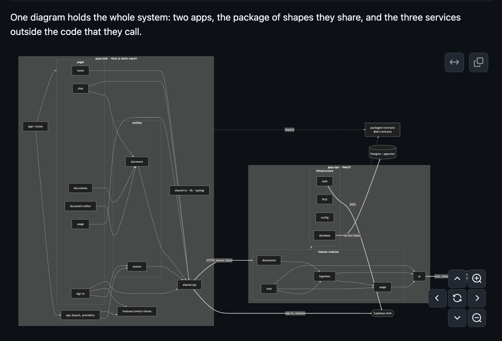

# PR #3: docs: design notes, and the carve of #2 into five children

- **State:** open
- **URL:** https://github.com/vzakharov/goodspeed-knowledge-base/pull/3
- **Author:** @vzakharov (agent)
- **Base ← Head:** main ← claude/decision-doc-1lmvss
- **Draft:** yes
- **Merged:** _not merged_
- **Created:** 2026-09-23T23:23:46Z
- **Updated:** 2026-09-24T01:58:05Z
- **Closed:** _not closed_
- **Labels:** _none_

---

## Body

## Summary

- **Adds `docs/design-notes.md`, "Design notes: how the knowledge base works, and why"** — Part B of #2, whole. Five sections: a mermaid map of every module with one chat question followed through it; seven choices weighed against their alternatives, with migration paths; sixteen mechanisms no single file shows; the house style and what the `/polish` passes produced; and twenty tradeoffs, each with what a real app does instead. Where `README.md` already states a decision, the entry links to it and adds only what it leaves out, and the README points at the document from § "Architecture decisions".
- **Carves #2 into five children, filed and natively linked:** #4 (this document), #5 (home route, header links, bootstrap key prompts), #6 (errors, types and names), #7 (tooling and repo hygiene), #8 (a measured `MIN_SIMILARITY`). Each child carries #2's own wording for its items, and each of #5–#8 updates the document in the same PR when it changes something the document describes.
- **Settles the history the document cites.** `withSearchParam` came from a `/dry` pass (a6caddb); the sparse delete copy was written as it stands (45aef6f); the `/tend-prose` example is `answerPrompt` (b9821da). Child 4 (#7) also restores the convention 67117f3 cut from `withSeverity`'s docstring.
- **Two findings went to the tracker rather than into the document as fixes:** a stopped or failed answer's tokens are never recorded (#6), and the committed `database.types.ts` lacks `markdown_excerpt` with no check comparing it to the schema (#7).

## QA Checklist

- [ ] `diagram` — Open `docs/design-notes.md` on GitHub: the §1 mermaid diagram renders, and every module under `apps/api/src/` and `apps/web/src/` appears in it
- [ ] `standalone` — Read the document cold: nothing refers to a review, an issue, a thread or who knew what, and no entry reads as a correction
- [ ] `links` — Follow a sample of `path:line` links in each section: each lands on the line the sentence describes
- [ ] `readme` — Each entry that links a README section adds to it rather than restating it; the README's new pointer line sits under § "Architecture decisions"
- [ ] `children` — #4–#8 show as sub-issues of #2, and each child's quoted items match #2's Part A
- [ ] `claims` — Spot-check the claims the drafts marked as resting on outside behaviour: Ollama on `localhost:11434/v1`, Supabase's `max_rows` applying to RPC results, OpenAI caching from 1,024 tokens

| Item         | Automatable | Covered? | Notes                                                                        |
| ------------ | ----------- | -------- | ---------------------------------------------------------------------------- |
| `diagram`    | manual-only | —        | Rendered locally with mermaid-cli; GitHub's renderer is the one that matters |
| `standalone` | manual-only | —        | Judgment on tone                                                             |
| `links`      | unit        | —        | A link checker ran over every link before commit; not part of vet            |
| `readme`     | manual-only | —        | Prose overlap, read side by side                                             |
| `children`   | manual-only | —        | Tracker state                                                                |
| `claims`     | manual-only | —        | Depends on third-party behaviour                                             |

Closes #4

🤖 Generated with [Claude Code](https://claude.com/claude-code)

https://claude.ai/code/session_01MWcKrLxD4Xr78bFaSV2rTF

---

## Comments

- **C01** @vzakharov (agent) — 2026-09-23T23:24:05Z — "Proposed squash title/body: ``` docs: #4 design notes on how…" → [↓](#c01)

<a id="c01"></a>

### Comment by @vzakharov (agent) on 2026-09-23T23:24:05Z

[https://github.com/vzakharov/goodspeed-knowledge-base/pull/3#issuecomment-5804605391](https://github.com/vzakharov/goodspeed-knowledge-base/pull/3#issuecomment-5804605391)

Proposed squash title/body:

```
docs: #4 design notes on how the knowledge base works, and why (pr #3)
```

```
The review of #1 asked for one document that explains the codebase's
trickier parts and its choices to a reader who was not there, and for
the code changes it raised to be carved into issues under #2. This is
the document, the first of those issues; the other four are filed as
#5 to #8, each a native sub-issue of #2.

docs/design-notes.md opens with a diagram of every module across the
API, the web app and @kb/contracts, and one chat question followed
through it. Then come the choices, each against its alternatives with
a migration path (NestJS beside Next.js, the contracts package,
node:test, the static export, the hand-drawn chart, the session store,
TanStack Query), and how the trickier parts work, from provider
presets and the auth guard to RLS, migrations and the build.

It closes on the house style, including what the /polish passes
produced and the type-overlap check, and on the shortcuts the PoC took
knowingly, each with what a real app would do, including those a sweep
of the codebase found beyond the review's. The README keeps its
architecture sections and points here; entries it already covers link
to it rather than restating it.

Closes #4

Co-authored-by: Claude <noreply@anthropic.com>
```

---

## Review threads

_8 resolved threads omitted; re-run with `--include-resolved` to export them._

- **T01** `docs/plans/decision-doc.draft.do-not-implement.md`:51 — unresolved — last: @vzakharov (agent) 2026-09-24T00:28:58Z — "Correction: 67117f3 is in this repo — the polish of the rule…" → [↓](#t01)
- **T02** `docs/design-notes.md`:70 — unresolved — last: @vzakharov (human) 2026-09-24T00:49:16Z — "alas, it's unreadable: <img width="767" height="522" alt="Im…" → [↓](#t02)
- **T03** `docs/design-notes.md`:178 — unresolved — last: @vzakharov (human) 2026-09-24T00:54:33Z — "the two communicate via bearer tokens only? no sessions, not…" → [↓](#t03)
- **T04** `docs/design-notes.md`:186 — unresolved — last: @vzakharov (human) 2026-09-24T00:55:42Z — "why are SWC & Node the only two choices? what about tsc or t…" → [↓](#t04)
- **T05** `docs/design-notes.md`:196 — unresolved — last: @vzakharov (human) 2026-09-24T00:57:29Z — "Too wordy for something that's not going to happen, condense…" → [↓](#t05)
- **T06** `docs/design-notes.md`:198 — unresolved — last: @vzakharov (human) 2026-09-24T01:00:08Z — "Got it; remove the section (it was mostly for my information…" → [↓](#t06)
- **T07** `docs/design-notes.md`:219 — unresolved — last: @vzakharov (human) 2026-09-24T01:02:25Z — "Condense each list (for staying, against staying, path over)…" → [↓](#t07)
- **T08** `docs/design-notes.md`:244 — unresolved — last: @vzakharov (human) 2026-09-24T01:03:30Z — "but generally nothing would keep us from moving session to c…" → [↓](#t08)
- **T09** `docs/design-notes.md`:246 — unresolved — last: @vzakharov (human) 2026-09-24T01:05:40Z — "were there any research/articles (from serious developers) a…" → [↓](#t09)
- **T10** `docs/design-notes.md`:268 — unresolved — last: @vzakharov (human) 2026-09-24T01:08:07Z — "but add that in that other repo it was a necessity because t…" → [↓](#t10)
- **T11** `docs/design-notes.md`:160 — unresolved — last: @vzakharov (human) 2026-09-24T01:09:23Z — "by the way, just realized they might ask why we are not usin…" → [↓](#t11)
- **T12** `docs/design-notes.md`:272 — unresolved — last: @vzakharov (human) 2026-09-24T01:10:20Z — "frame it as a choice of store framework, not vs specifically…" → [↓](#t12)
- **T13** `docs/design-notes.md`:280 — unresolved — last: @vzakharov (human) 2026-09-24T01:11:58Z — "describe more simply a case where we would need to introduce…" → [↓](#t13)
- **T14** `docs/design-notes.md`:295 — unresolved — last: @vzakharov (human) 2026-09-24T01:13:13Z — "SWR?" → [↓](#t14)
- **T15** `docs/design-notes.md`:346 — unresolved — last: @vzakharov (human) 2026-09-24T01:14:42Z — "Rephrase as "The app can also work with a local LLM like ...…" → [↓](#t15)
- **T16** `docs/design-notes.md`:363 — unresolved — last: @vzakharov (human) 2026-09-24T01:17:42Z — "okay so it's basically just a notation: we get a request, an…" → [↓](#t16)
- **T17** `docs/design-notes.md`:525 — unresolved — last: @vzakharov (human) 2026-09-24T01:23:08Z — "let's mention the studio url too" → [↓](#t17)
- **T18** `docs/design-notes.md`:557 — unresolved — last: @vzakharov (human) 2026-09-24T01:25:49Z — "as a direction for improvement, add a way (lint rule, separa…" → [↓](#t18)
- **T19** `docs/design-notes.md`:554 — unresolved — last: @vzakharov (human) 2026-09-24T01:26:21Z — "how does this work, precisely? how does an anon become a "no…" → [↓](#t19)
- **T20** `docs/design-notes.md`:569 — unresolved — last: @vzakharov (human) 2026-09-24T01:26:59Z — "pgTAP?" → [↓](#t20)
- **T21** `docs/design-notes.md`:619 — unresolved — last: @vzakharov (human) 2026-09-24T01:29:28Z — "none seem unsurmountable though? or, if they are, does it me…" → [↓](#t21)
- **T22** `docs/design-notes.md`:646 — unresolved — last: @vzakharov (human) 2026-09-24T01:30:06Z — "so it's never like with drizzle, where we define the types (…" → [↓](#t22)
- **T23** `docs/design-notes.md`:658 — unresolved — last: @vzakharov (human) 2026-09-24T01:30:55Z — "how's that? and what's the remedy in our case?" → [↓](#t23)
- **T24** `docs/design-notes.md`:715 — unresolved — last: @vzakharov (human) 2026-09-24T01:33:29Z — "ah... so it's not some predefined "@kb/contracts" package, i…" → [↓](#t24)
- **T25** `docs/design-notes.md`:780 — unresolved — last: @vzakharov (human) 2026-09-24T01:43:26Z — "okay thx let's ditch the section :)" → [↓](#t25)
- **T26** `docs/design-notes.md`:854 — unresolved — last: @vzakharov (human) 2026-09-24T01:45:27Z — "I though I said to ditch it in the plan already :)" → [↓](#t26)
- **T27** `docs/design-notes.md`:894 — unresolved — last: @vzakharov (human) 2026-09-24T01:48:30Z — "sorry but I didn't even understand what we were trying to sa…" → [↓](#t27)
- **T28** `docs/design-notes.md`:945 — unresolved — last: @vzakharov (human) 2026-09-24T01:53:06Z — "let's ditch it if supabase-js already has it (the "what help…" → [↓](#t28)

<a id="t01"></a>

### `docs/plans/decision-doc.draft.do-not-implement.md`:51 — unresolved

```diff
@@ -0,0 +1,117 @@
… 47 lines elided …
+3. **How it works**, the eighteen entries #2 lists. The one on the conversation switch (T40) is traced through the code, and is reproduced in the app if the code leaves it unclear (`/preview` for the…
+4. **House style and what the process produced**, the six entries, with these traces already settled:
+   - **`withSearchParam` came from a polish run.** `a6caddb` "polish: one helper for a path carrying a search parameter" folded four hand-spelled copies (`documentsHref`, `documentHref`, `chatHref`, …
+   - **The sparse delete copy did not.** It was written as it stands in the feature commit (`45aef6f`). The polish run over those files (`b7cad84`) tightened the `ConfirmDelete` docstring, not the copy. The entry attributes the copy to the feature commit and the house voice, and uses `b7cad84` as the example of polish working on comments rather than UI text.
```

**@vzakharov (human)** — 2026-09-23T23:59:22Z

then let's try and programmatically find (maybe via a subagent) the biggest tightening of a docstring during polish as an example

**@vzakharov (agent)** — 2026-09-24T00:11:06Z

A subagent ranked every docstring the 18 `polish:` commits shortened. The biggest cut is `withSeverity` in 67117f3 (76% shorter), but it also dropped a convention that now lives nowhere: a rule whose `'off'` has its own reason stays on its own line. So the example is the runner-up from the same commit, `isRedundantDefaultedObjectParam` (104 → 54 words, every condition kept), and child 4 puts the lost convention back — 41c391d.

**@vzakharov (agent)** — 2026-09-24T00:12:03Z

Correction: both of those were in the ESLint ruleset the seed carried in from the parent repo, so they aren't this project's polish. Ranked again over code written here, the example is `answerPrompt` in `prompt.ts` (b9821da, 37 words to 13): the description of the prompt's shape went, since the code shows it, and the one rule the code doesn't show stayed, that sources number from 1, most similar first. Child 4 no longer restores the `withSeverity` convention — 73508f7.

**@vzakharov (human)** — 2026-09-24T00:15:23Z

ok, but let the child restore still

**@vzakharov (agent)** — 2026-09-24T00:18:02Z

Done: child 4 restores it again, attributed to the parent repo's polish since 67117f3 is not in this history — de145ec.

**@vzakharov (agent)** — 2026-09-24T00:28:58Z

Correction: 67117f3 is in this repo — the polish of the ruleset 31586b1 carried in — so child 4 (#7) and the plan now say so — acf10c3.

---

<a id="t02"></a>

### `docs/design-notes.md`:70 — unresolved

```diff
@@ -0,0 +1,1138 @@
… 66 lines elided …
+
+One diagram holds the whole system: two apps, the package of shapes they share, and the three services outside the code that they call.
+
+```mermaid
```

**@vzakharov (human)** — 2026-09-24T00:49:16Z

alas, it's unreadable:



let's make a high-level one with both next & nest in an abridged form, and two separate ones with inputs from/outputs to the other one(s) from/to ellipses

---

<a id="t03"></a>

### `docs/design-notes.md`:178 — unresolved

```diff
@@ -0,0 +1,1138 @@
… 174 lines elided …
+
+- **Nothing on the server has to fit into a page request.** Ingestion embeds a document inside the save request, and an answer streams for as long as the model keeps writing ([`conversations.controll…
+- **Routes are private unless marked otherwise.** The guard runs on every route, so a new endpoint needs a token unless it is marked `@Public()` ([`auth.guard.ts:44-49`](../apps/api/src/auth/auth.gua…
+- **The API works for any client.** It takes bearer tokens and has a written contract, so the end-to-end suite ([`app.e2e.test.ts`](../apps/api/test/app.e2e.test.ts)), a CLI or a mobile app can call it exactly as the browser does.
```

**@vzakharov (human)** — 2026-09-24T00:54:33Z

the two communicate via bearer tokens only? no sessions, nothing like that? who issues the tokens and when?

(here and below, unless otherwise mentioned, questions are just questions, not requiring any changes to the wordings. Does not apply to directives ["do that"])

---

<a id="t04"></a>

### `docs/design-notes.md`:186 — unresolved

```diff
@@ -0,0 +1,1138 @@
… 182 lines elided …
+- Two dev servers, two origins, and the CORS setup that comes with them ([`app.ts:21-26`](../apps/api/src/app.ts#L21-L26)).
+- A contracts package that has to be built before either app runs (`dependsOn: ["^build"]`, [`turbo.json:14-35`](../turbo.json#L14-L35)). A server action's argument and return types cross from server…
+- Every page loads its data from the browser, after the session has been read. A page rendered on the server skips that wait.
+- Nest's dependency injection relies on decorator metadata, which is why the API compiles through SWC ([`register.js`](../apps/api/register.js)) rather than with Node's own type stripping.
```

**@vzakharov (human)** — 2026-09-24T00:55:42Z

why are SWC & Node the only two choices? what about tsc or tsx or smth? (Just my first time running across "swc" hence all the questions.)

---

<a id="t05"></a>

### `docs/design-notes.md`:196 — unresolved

```diff
@@ -0,0 +1,1138 @@
… 186 lines elided …
+
+The monorepo follows from the split: two apps sharing one contract need a workspace and a task runner. A single app would give Turborepo nothing to do.
+
+Moving to the single-app shape is mostly a matter of moving code:
+
+- The model layer, the chunker, the prompt builder, the config parser, the token verifier and the database helpers import nothing from Nest ([`ai/`](../apps/api/src/ai/), [`chunker.ts`](../apps/api/src/ingestion/chunker.ts), [`prompt.ts`](../apps/api/src/chat/prompt.ts), [`env.ts`](../apps/api/src/config/env.ts), [`database.ts`](../apps/api/src/database/database.ts)). They move as they are.
+- The services use Nest only for `@Injectable`, the two model tokens, `NotFoundException` and `Logger`, and each one takes the reader as an argument. They become plain modules, with the two models built once from the config.
+- The controllers become route handlers under `/api`, so the web client changes only its base URL and the end-to-end suite keeps its paths.
+- The guard becomes a helper that reads the Supabase session from cookies (`@supabase/ssr`), because the server cannot see the browser's storage. From that session it builds the reader's database client, as `createReaderDb` does now. Row-level security keeps working unchanged, because every query still runs as the reader.
+- The web app drops `output: 'export'`, and `@kb/contracts` becomes a slice of its `shared/` layer.
```

**@vzakharov (human)** — 2026-09-24T00:57:29Z

Too wordy for something that's not going to happen, condense to one normal-sized paragraph.

---

<a id="t06"></a>

### `docs/design-notes.md`:198 — unresolved

```diff
@@ -0,0 +1,1138 @@
… 194 lines elided …
+- The guard becomes a helper that reads the Supabase session from cookies (`@supabase/ssr`), because the server cannot see the browser's storage. From that session it builds the reader's database cli…
+- The web app drops `output: 'export'`, and `@kb/contracts` becomes a slice of its `shared/` layer.
+
+### One contracts package, not a shared `src/`
```

**@vzakharov (human)** — 2026-09-24T01:00:08Z

Got it; remove the section (it was mostly for my information, I doubt anyone would actually wonder).

---

<a id="t07"></a>

### `docs/design-notes.md`:219 — unresolved

```diff
@@ -0,0 +1,1138 @@
… 215 lines elided …
+
+`node:test` stays because, at this size, it does everything the suites ask of it with no dependency and no config file. The API's 41 unit tests run in about 1.4 seconds. Across the repo, the suites u…
+
+For staying:
```

**@vzakharov (human)** — 2026-09-24T01:02:25Z

Condense each list (for staying, against staying, path over) to a paragraph each.

---

<a id="t08"></a>

### `docs/design-notes.md`:244 — unresolved

```diff
@@ -0,0 +1,1138 @@
… 240 lines elided …
+
+The static export arrived with the frontend foundation this repo was seeded from: `31586b1` added `output: 'export'` along with the Mantine theme and the FSD layout. Nobody weighed it for this app at…
+
+Why it fits: every page sits behind sign-in and shows one reader's own data. There is nothing to prerender with data in it and nothing for a search engine to index. A server would not even know who is asking, because supabase-js keeps the session in the browser's storage, and a server sees it only if the session moves to cookies. The build output is plain files, so any CDN can serve the web app without a Node process.
```

**@vzakharov (human)** — 2026-09-24T01:03:30Z

but generally nothing would keep us from moving session to cookies?

---

<a id="t09"></a>

### `docs/design-notes.md`:246 — unresolved

```diff
@@ -0,0 +1,1138 @@
… 242 lines elided …
+
+Why it fits: every page sits behind sign-in and shows one reader's own data. There is nothing to prerender with data in it and nothing for a search engine to index. A server would not even know who i…
+
+What it costs, all visible in the code:
```

**@vzakharov (human)** — 2026-09-24T01:05:40Z

were there any research/articles (from serious developers) about one vs the other, is it a sort of a no-one-size-fits-all questions, or has the industry pretty much settled on which one to use in saas's like this one?

---

<a id="t10"></a>

### `docs/design-notes.md`:268 — unresolved

```diff
@@ -0,0 +1,1138 @@
… 264 lines elided …
+
+The same reasoning applies to any makeshift part an agent writes in place of a library. The agent writes it in minutes, it does exactly one job, and nothing else depends on it.
+
+The risk is that the part keeps growing without anyone deciding it should. Each request is small: a second kind of series, a legend that toggles kinds on and off, zooming into a date range, axis labels that thin out on a narrow screen. Each is also code a library already has, tested against cases this component has never met. One feature at a time, the makeshift part becomes an unmaintained library. A spreadsheet reader in another app built the same way went that way: written to read one kind of upload, it is now fourteen modules that decode Excel's legacy binary format record by record, cells, strings and all, with a test suite to match.
```

**@vzakharov (human)** — 2026-09-24T01:08:07Z

but add that in that other repo it was a necessity because the only external package that could do this was unmaintained and had a security advisory. Also note (in a separate paragraph) that security advisories now come more often because they are found by agents as well (provide some examples of high-profile breaches recently), so relying on an extra package is not as simple a choice as it used to be.

---

<a id="t11"></a>

### `docs/design-notes.md`:160 — unresolved

```diff
@@ -0,0 +1,1138 @@
… 156 lines elided …
+3. The controller opens an event stream and hands the question to `AnswerService.answer` ([`apps/api/src/chat/conversations.controller.ts:85`](../apps/api/src/chat/conversations.controller.ts#L85), […
+   - it asks the chat model to rewrite a follow-up so it stands alone, because retrieval sees only the query, not the conversation;
+   - it embeds that query and calls the database function `match_document_chunks` as the reader, so row-level security limits the search to the reader's own documents ([`answer.service.ts:159`](../ap…
+   - it streams the chat model's answer over the numbered chunks, passing each piece of text to the browser as it arrives;
```

**@vzakharov (human)** — 2026-09-24T01:09:23Z

by the way, just realized they might ask why we are not using "agentic frameworks" like mastra etc. Obviously, they're из пушки по воробьям in this case, but I should be able to testify to my knowledge of them in either case.

---

<a id="t12"></a>

### `docs/design-notes.md`:272 — unresolved

```diff
@@ -0,0 +1,1138 @@
… 268 lines elided …
+
+The signal to switch is a change that is about charts in general rather than about this app's usage data. A second chart somewhere else in the app is one sign. So is a fix for an edge case libraries …
+
+### The session in `useSyncExternalStore`, not Zustand
```

**@vzakharov (human)** — 2026-09-24T01:10:20Z

frame it as a choice of store framework, not vs specifically zustand; the session should not read to much as an answer to "why not zustand?" (which it of course was but the document should read durably)

---

<a id="t13"></a>

### `docs/design-notes.md`:280 — unresolved

```diff
@@ -0,0 +1,1138 @@
… 276 lines elided …
+
+A Zustand version would be `create(() => LOADING)` plus the same listener calling `setState`. The part that needs care would still be there. The listener is attached the first time a component uses t…
+
+Zustand pays off once client state has several fields and several writers. It gives selectors, so a component re-renders only for the field it reads, actions kept beside the state, and middleware such as `persist` and devtools. Server data belongs to TanStack Query (next entry), so a store here would hold client-only state shared by components far apart in the tree. The nearest candidate is the answer being streamed. It lives in the chat page's `useAsking` ([`use-asking.ts:22-31`](../apps/web/src/pages/chat/model/use-asking.ts#L22-L31)), so it stops when the reader leaves the chat. Keeping it running while the reader moves around the app means holding it above the router, and that is where a store would go.
```

**@vzakharov (human)** — 2026-09-24T01:11:58Z

describe more simply a case where we would need to introduce Zustand (or similar). If none obvious ones come to mind, let's just drop the section as a quasi-polar bear

---

<a id="t14"></a>

### `docs/design-notes.md`:295 — unresolved

```diff
@@ -0,0 +1,1138 @@
… 291 lines elided …
+- **Only failures that might pass get a retry.** A 5xx or a network failure is retried twice. A 4xx, or a response the contract rejects, fails at once ([`query-client.ts:7-25`](../apps/web/src/shared…
+- **Signing out clears the cache.** The next reader in the same tab starts with none of the previous reader's data ([`session.ts:47-52`](../apps/web/src/entities/session/model/session.ts#L47-L52)).
+
+Without it, each component would call `fetch` in a `useEffect` and track its own loading, error and cached data by hand, which means writing the code above again on every page. SWR does the same job with a smaller API. Mutations and invalidation by key prefix are the parts of TanStack Query this app relies on most.
```

**@vzakharov (human)** — 2026-09-24T01:13:13Z

SWR?

---

<a id="t15"></a>

### `docs/design-notes.md`:346 — unresolved

```diff
@@ -0,0 +1,1138 @@
… 342 lines elided …
+with the vector column's, for the same reason
+([`ai.module.ts:43-53`](../apps/api/src/ai/ai.module.ts#L43-L53)).
+
+"A local Ollama" is a program on the same machine, not a hosted service.
```

**@vzakharov (human)** — 2026-09-24T01:14:42Z

Rephrase as "The app can also work with a local LLM like ..., which ...

---

<a id="t16"></a>

### `docs/design-notes.md`:363 — unresolved

```diff
@@ -0,0 +1,1138 @@
… 359 lines elided …
+[README § "Swapping AI providers"](../README.md#swapping-ai-providers) walks
+through that migration.
+
+### How the API knows a request is a `ReaderRequest`
```

**@vzakharov (human)** — 2026-09-24T01:17:42Z

okay so it's basically just a notation: we get a request, and we expect it to be ReaderRequest? Let's ditch the section

---

<a id="t17"></a>

### `docs/design-notes.md`:525 — unresolved

```diff
@@ -0,0 +1,1138 @@
… 521 lines elided …
+  ([`bootstrap.ts:54-79`](../scripts/bootstrap.ts#L54-L79)), and the file is
+  gitignored. An asymmetric key is what lets the API verify tokens against the
+  published key set instead of holding a shared secret.
+- **Auth's site URL is the web app's**, `http://localhost:3000`
```

**@vzakharov (human)** — 2026-09-24T01:23:08Z

let's mention the studio url too

---

<a id="t18"></a>

### `docs/design-notes.md`:557 — unresolved

```diff
@@ -0,0 +1,1138 @@
… 553 lines elided …
+4. **PostgREST checks the token again and acts as the user.** It switches to the
+   `authenticated` role named in the token and exposes the claims to SQL, where
+   `auth.uid()` reads `sub`.
+5. **Every table has row-level security on, with one policy per operation**,
```

**@vzakharov (human)** — 2026-09-24T01:25:49Z

as a direction for improvement, add a way (lint rule, separate script, etc.) to ensure no table can be added without RLS

---

<a id="t19"></a>

### `docs/design-notes.md`:554 — unresolved

```diff
@@ -0,0 +1,1138 @@
… 550 lines elided …
+   ([`apps/api/src/database/database.ts:30-38`](../apps/api/src/database/database.ts#L30-L38)).
+   The publishable key alone admits a caller as `anon`, a role no policy lets
+   read any row. The token is what makes the caller someone.
+4. **PostgREST checks the token again and acts as the user.** It switches to the
```

**@vzakharov (human)** — 2026-09-24T01:26:21Z

how does this work, precisely? how does an anon become a "non"?

---

<a id="t20"></a>

### `docs/design-notes.md`:569 — unresolved

```diff
@@ -0,0 +1,1138 @@
… 565 lines elided …
+6. **The functions are `security invoker`**, so the policies apply inside them
+   as well (see the next entry).
+
+The pgTAP suite tests the rule where it lives. It does what PostgREST does per
```

**@vzakharov (human)** — 2026-09-24T01:26:59Z

pgTAP?

---

<a id="t21"></a>

### `docs/design-notes.md`:619 — unresolved

```diff
@@ -0,0 +1,1138 @@
… 604 lines elided …
+Each is a function rather than a query built in TypeScript for one of three
+reasons:
+
+- **One transaction.** A PostgREST request is one operation on one table, and
+  `replace_document_chunks` needs four together: lock the document while its
+  content hash still matches, delete the old chunks, insert the new ones, mark
+  the document ready
+  ([`supabase/migrations/20260923100503_document_chunks.sql:68-113`](../supabase/migrations/20260923100503_document_chunks.sql#L68-L113)).
+- **SQL the query builder cannot express.** The search orders by pgvector's
+  distance operator and sets HNSW's iterative scan
+  ([`document_chunks.sql:124-162`](../supabase/migrations/20260923100503_document_chunks.sql#L124-L162)).
+  The totals and tag counts group and aggregate.
+- **Typed results.** A function's declared columns are generated as non-null
+  types, and a view's are all generated as nullable, which is why the list
+  reads are functions and not views.
```

**@vzakharov (human)** — 2026-09-24T01:29:28Z

none seem unsurmountable though? or, if they are, does it mean we're forever bound to use pg functions instead of "normal" typescript?

---

<a id="t22"></a>

### `docs/design-notes.md`:646 — unresolved

```diff
@@ -0,0 +1,1138 @@
… 642 lines elided …
+   also what `pnpm bootstrap` runs. `pnpm db:reset` rebuilds the local database
+   from every migration, which checks that the whole sequence still applies
+   from empty.
+4. `pnpm db:types` regenerates `apps/api/src/database/database.types.ts` from
```

**@vzakharov (human)** — 2026-09-24T01:30:06Z

so it's never like with drizzle, where we define the types (schemas), and get migrations autogenerated from there?

---

<a id="t23"></a>

### `docs/design-notes.md`:658 — unresolved

```diff
@@ -0,0 +1,1138 @@
… 654 lines elided …
+types with the schema, and the committed file shows the cost: it lacks
+`markdown_excerpt`, which the last migration added and the generator emits. The
+file lags because nothing in TypeScript calls that function, so nothing failed.
+A real project would regenerate the types in CI and fail on a diff.
```

**@vzakharov (human)** — 2026-09-24T01:30:55Z

how's that? and what's the remedy in our case?

---

<a id="t24"></a>

### `docs/design-notes.md`:715 — unresolved

```diff
@@ -0,0 +1,1138 @@
… 711 lines elided …
+
+The web app's schemas for what it sends to and reads from the API are the backend's own. Both apps import the same Zod schemas from `packages/contracts`, and the web app defines none of its own for a…
+
+`"@kb/contracts": "workspace:*"` ([`apps/web/package.json:13`](../apps/web/package.json#L13)) is pnpm's workspace protocol: the dependency is the package of that name in this repository, at whatever version it has, never one from the npm registry. `pnpm install` links it as a symlink, `apps/web/node_modules/@kb/contracts → packages/contracts`, and the API depends on it the same way ([`apps/api/package.json:16`](../apps/api/package.json#L16)). The package's `exports` point at its build in `dist/` ([`packages/contracts/package.json:6-11`](../packages/contracts/package.json#L6-L11)), so each app consumes plain JavaScript and `.d.ts` files, as it would any npm package, and the package has to be built before either app runs.
```

**@vzakharov (human)** — 2026-09-24T01:33:29Z

ah... so it's not some predefined "@kb/contracts" package, it's a package we "created" for ourselves here, using the `workspace` "protocol"? so technically we could put any shared code (e.g. some helpers needed in both) in the same way?

---

<a id="t25"></a>

### `docs/design-notes.md`:780 — unresolved

```diff
@@ -0,0 +1,1138 @@
… 776 lines elided …
+
+The database needs a suite of its own because the API guards most reads twice. Its queries also filter on the reader's id ([`documents.service.ts:86`](../apps/api/src/documents/documents.service.ts#L…
+
+### The usage chart's SVG, from data to path commands
```

**@vzakharov (human)** — 2026-09-24T01:43:26Z

okay thx let's ditch the section :)

---

<a id="t26"></a>

### `docs/design-notes.md`:854 — unresolved

```diff
@@ -0,0 +1,1138 @@
… 850 lines elided …
+
+The first sentence described the message list, which the function body shows in three lines just below it. The second states a rule the body cannot show, because the order is the caller's: the source…
+
+### The confirmation copy
```

**@vzakharov (human)** — 2026-09-24T01:45:27Z

I though I said to ditch it in the plan already :)

---

<a id="t27"></a>

### `docs/design-notes.md`:894 — unresolved

```diff
@@ -0,0 +1,1138 @@
… 878 lines elided …
+
+The API shows the result. `ModelIdentity` declares `provider` and `model` once ([`models.ts:10-13`](../apps/api/src/ai/models.ts#L10-L13)), and the chat model, the embedding model, the client setting…
+
+The clearest record is a run that failed. After the commit that added the web app's sign-in and API client (`3a0d33b`), the check reported three members the web app had written again, each already declared in the API:
+
+```text
+baseUrl: string;       ModelSettings (API)   ApiClientOptions (web)
+model: string;         ModelIdentity (API)   ModelCardProps (web)
+signal?: AbortSignal;  Cancellable (API)     ApiRequest (web)
+```
+
+No fix imported an API type into the web app. Each took the fix its case needed (`f81617a`):
+
+- **`baseUrl` was a name that meant two things.** The API's is a model provider's address, the web app's is this app's own API. A shared base would have tied together two unrelated settings, so the web app's became `apiUrl`, after the `NEXT_PUBLIC_API_URL` it is read from ([`api-client.ts:20-24`](../apps/web/src/shared/api/api-client.ts#L20-L24)).
+- **`model` was a copy of the contract.** The home page's model card now takes `provider` and `model` from `AiSettings['chat']` in `@kb/contracts` ([`home-page.tsx:12-15`](../apps/web/src/pages/home/ui/home-page.tsx#L12-L15)), so it follows whatever the API says it sends.
+- **`signal` was a copy of the platform.** The request options take `method` and `signal` from `fetch`'s own `RequestInit` ([`api-client.ts:15`](../apps/web/src/shared/api/api-client.ts#L15)).
```

**@vzakharov (human)** — 2026-09-24T01:48:30Z

sorry but I didn't even understand what we were trying to say here. It seems like you're arguing *against* type overlap check here? :)

what I want is smth like: these were defined in separate places, and only thanks to the type overlap check we were able to find out they were actually related. or smth.

if that's what you're already saying, maybe we should try rephrasing it for clarity

---

<a id="t28"></a>

### `docs/design-notes.md`:945 — unresolved

```diff
@@ -0,0 +1,1138 @@
… 941 lines elided …
+
+A real app gives the not-found error one class, built from the entity's name and id, and one scoped-row helper (the next entries show where it would live). The password rule is read from one source, …
+
+### Query code without a helper layer
```

**@vzakharov (human)** — 2026-09-24T01:53:06Z

let's ditch it if supabase-js already has it (the "what helper adds" case doesn't sound, erm, sound)

---

## Timeline (status, references, and other events)

- **2026-09-24T00:07:09Z** @vzakharov reviewed (COMMENTED): https://github.com/vzakharov/goodspeed-knowledge-base/pull/3#pullrequestreview-5297946991.
- **2026-09-24T00:18:51Z** @vzakharov cross-referenced this pull request from [#4 Design notes: how the knowledge base works, and why](https://github.com/vzakharov/goodspeed-knowledge-base/issues/4).
- **2026-09-24T00:34:58Z** @vzakharov renamed from «docs: carve #2 and plan the decision document» to «docs: design notes, and the carve of #2 into five children».
- **2026-09-24T01:58:05Z** @vzakharov reviewed (COMMENTED): https://github.com/vzakharov/goodspeed-knowledge-base/pull/3#pullrequestreview-5298457410.
